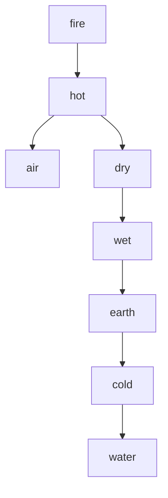

# The Beginnings of Western Science

by David C. Lindberg

# CHAPTER TWO THE GREEKS AND THE COSMOS

[...]

# Plato's World of Forms

The death of Socrates in 399 B.C., coming as it did around the turn of the century (not on their calendar, of course, but on ours), has made it a convenient point of demarcation in the history of Greek philosophy. Thus Socrates' predecessors of the sixth and fifth centuries (the philosophers who have occupied us until now in this chapter) are commonly called the "pre-Socratic philosophers." But Socrates' prominence is more than an accident of the calendar, for Socrates represents a shift in emphasis within Greek philosophy, away from the cosmological concerns of the sixth and fifth centuries toward political and ethical matters. Nonetheless, the shift was not so dramatic as to preclude continuing attention to the major problems of

pre-Socratic philosophy. We find both the new and the old in the work of Socrates' younger friend and disciple, Plato (fig. 2.4).

natural_image

Stone bust of an ancient bearded man, likely a philosopher or philosopher, with detailed facial features and beard (no inscriptions or symbols visible)

Fig. 2.4. Plato (1st c. A.D. copy). Museo Vaticano, Vatican City. Alinari/Art Resource N.Y.

29

Plato (427鈥?48/47) was born into a distinguished Athenian family, active in affairs of state; he was undoubtedly a close observer of the political events that led up to Socrates' execution. After Socrates' death, Plato left Athens and visited Italy and Sicily, where he seems to have come into contact with Pythagorean philosophers. In 388 Plato returned to Athens and founded a school of his own, the Academy, where young men could pursue advanced studies (see fig. 4.1). Plato's literary output appears to have consisted almost entirely of dialogues, the majority of which have survived. We will find it necessary to be highly selective in our examination of Plato's philosophy; let us begin with his quest for the underlying reality.

30

In a passage in one of his dialogues, the Republic, Plato reflected on the relationship between the actual tables constructed by a carpenter and the idea or definition of a table in the carpenter's mind. The carpenter replicates the mental idea as closely as possible in each table he makes, but always imperfectly. No two manufactured tables are alike down to the smallest detail, and limitations in the material (a knot here, a warped board there) ensure that none will fully measure up to the ideal.

31

Now, Plato argued, there is a divine craftsman who bears the same relationship to the cosmos as the carpenter bears to his tables. The divine craftsman (the Demiurge) constructed the cosmos according to an idea or plan, so that the cosmos

and everything in it are replicas of eternal ideas or forms鈥攂ut always imperfect replicas because of limitations inherent in the materials available to the Demiurge. In short, there are two realms: a realm of forms or ideas, containing the perfect form of everything; and the material realm in which these forms or ideas are imperfectly replicated.

Plato's notion of two distinct realms will seem strange to many people, and we must therefore stress several points of importance. The forms are incorporeal, intangible, and insensible; they have always existed, sharing the property of eternity with the Demiurge; and they are absolutely changeless. They include the form, the perfect idea, of everything in the material world. One does not speak of their location, since they are incorporeal and therefore not spatial. Although incorporeal and imperceptible by the senses, they objectively exist; indeed, true reality (reality in its fullness) is located only in the world of forms. The sensible, corporeal world, by contrast, is imperfect and transitory. It is less real in the sense that the corporeal object is a replica of, and therefore dependent for its existence upon, the form. The form has primary existence, its corporeal replica secondary existence.

Plato illustrated this conception of reality in his famous 鈥渁llegory of the cave,鈥?found in book VII of the Republic. Men are imprisoned within a deep cave, chained so as to be incapable of moving their heads. Behind them is a wall, and beyond that a fire. People walk back and forth behind the wall, holding above it various objects, including statues of humans and animals; the objects cast shadows on the wall that is visible to the prisoners. The prisoners see only the shadows cast by these objects; and, having lived in the cave from childhood, they no longer recall any other reality. They do not suspect that these shadows are but imperfect images of objects that they cannot see; and consequently they mistake the shadows for the real.

So it is with all of us, says Plato. We are souls imprisoned in bodies. The shadows of the allegory represent the world of sense experience. The soul, peering out from its prison, is able to perceive only these flickering shadows, and the ignorant claim that this is all there is to reality. However, there do exist the statues and other objects of which the shadows are feeble representations and also the humans and animals of which the statues are imperfect replicas. To gain access to these higher realities, we must escape the bondage of sense experience and climb out of the cave, until we find ourselves able, finally, to gaze on the eternal realities, thereby entering the realm of true knowledge.

What are the implications of these views for the concerns of the pre-Socratic philosophers? First, Plato equated his forms with the underlying reality, while assigning derivative or secondary existence to the corporeal world of sensible things. Second, Plato has made room for both change and stability by assigning each to a different level of reality: the corporeal realm is the scene of imperfection and change, while the realm of forms is characterized by eternal, changeless perfection. Both change and stability are therefore genuine; each characterizes something; but changelessness belongs to the forms and thus shares their fuller reality.

Third, as we have seen, Plato addressed epistemological questions, placing observation and true knowledge (or understanding) in opposition. Far from leading upward to knowledge or understanding, the senses are chains that tie us down; the route to knowledge is through philosophical reflection. This is explicit in the Phaedo, where Plato maintains the uselessness of the senses for the acquisition of truth and points out that when the soul attempts to employ them it is inevitably deceived.

Now the short account of Plato's epistemology frequently ends here; but there are important qualifications that it would be a serious mistake to omit. Plato did not, in fact, dismiss the senses altogether, as Parmenides had done and as the passage from the Phaedo might suggest Plato did. Sense experience, in Plato's view, served various useful functions. First, sense experience may provide wholesome recreation. Second, observation of certain sensible objects (especially those with geometrical properties) may serve to direct the soul toward nobler objects in the realm of forms. Plato used this argument as justification for the pursuit of astronomy. Third, Plato argued (in his theory of reminiscence) that sense experience may actually stir the memory and remind the soul of forms that it knew in a prior existence, thus stimulating a process of recollection that will lead to actual knowledge of the forms.

Finally, although Plato firmly believed that knowledge of the eternal forms (the highest, and perhaps the only true, form of knowledge) is obtainable only through the exercise of reason, the changeable realm of matter is also an acceptable object of study. Such studies serve the purpose of supplying examples of the operation of reason in the cosmos. If this is what interests us (as it sometimes did Plato), the best method of exploring it is surely to observe it. The legitimacy and utility of sense experience are clearly implied in the Republic, where Plato acknowledged that a prisoner emerging from the cave first employs his sense of sight to apprehend living creatures, the stars, and finally the most noble of visible (material) things, the

sun. But if he aspires to apprehend 鈥渢he essential reality,鈥?he must proceed 鈥渢hrough the discourse of reason unaided by any of the senses.鈥?Both reason and sense are thus instruments worth having; which one we employ on a particular occasion will depend on the object of study.

There is another way of expressing all of this, which may shed light on Plato's achievement. When Plato assigned reality to the forms, he was, in fact, identifying reality with the properties that classes of things have in common. The bearer of true reality is not (for example) this dog with the droopy left ear or that one with the menacing bark, but the idealized form of a dog shared (imperfectly, to be sure) by every individual dog鈥攖hose characteristics by virtue of which we are able to classify all of them as dogs. Therefore, to gain true knowledge, we must set aside all characteristics peculiar to things as individuals and seek the shared characteristics that define them into classes. Now stated in this modest fashion, Plato's view has a distinctly modern ring. Idealization is a prominent feature of a great deal of modern science; we develop models or laws that overlook the incidental in favor of the essential. However, Plato went beyond this, maintaining not merely that true reality is to be found in the common properties of classes of things, but also that this common property (the idea or form) has objective, independent, and indeed prior existence.

39

[...]

Text 2

from

# The Beginnings of Western Science

by David C. Lindberg

# CHAPTER THREE ARISTOTLE'S PHILOSOPHY OF NATURE

# Life and Works

Aristotle (fig. 3.1) was born in 384 B.C. in the northern Greek town of Stagira, into a privileged family. His father was personal physician to the Macedonian king, Amyntas II (grandfather of Alexander the Great). Aristotle had the advantage of an exceptional education: at age seventeen, he was sent to Athens to study with Plato. He remained in Athens as a member of Plato's Academy for twenty years, until Plato's death about 347. Aristotle then spent several years in travel and study, crossing the Aegean Sea to Asia Minor and its coastal islands. During this period he undertook biological studies, and he encountered Theophrastus (from the island of Lesbos), who was to become his pupil and lifetime colleague. He returned to Macedonia in 342 to become the tutor of the young Alexander (later 鈥渢he Great鈥?. In 335, when Athens fell under Macedonian rule, Aristotle returned to the city and

1

began to teach in the Lyceum, a public garden frequented by teachers. He remained there, establishing an informal school, until shortly before his death in 322.

2

In the course of his long career as student and teacher, Aristotle systematically and comprehensively addressed the major philosophical issues of his day. He is credited with more than 150 treatises, approximately 30 of which have come down to us. The surviving works appear to consist mainly of lecture notes or unfinished treatises not intended for wide circulation; whatever their exact origin, they were obviously directed to other philosophers, including advanced students. In modern translation, they occupy well over a foot of bookshelf, and they present a philosophical system overwhelming in power and scope. It is out of the question for us to survey the whole of Aristotle's philosophy, and we must be content with examining the fundamentals of his philosophy of nature鈥攂eginning with his response to positions taken by the pre-Socratics and Plato.

natural_image

Black-and-white photograph of a classical marble bust of a bearded man (no inscriptions or symbols visible)

Fig. 3.1. Aristotle. Museo Nazionale, Rome. Alinari/Art Resource N.Y.

# Metaphysics and Epistemology

3 Through his long association with Plato, Aristotle had, of course, become thoroughly versed in Plato's theory of forms. Plato had drastically diminished (without totally rejecting) the reality of the material world observed by the senses. Reality in

its perfect fullness, Plato argued, is found only in the eternal forms, which are dependent on nothing else for their existence. The objects that make up the sensible world, by contrast, derive their characteristics and their very being from the forms; it follows that sensible objects exist only derivatively or dependently.

Aristotle refused to accept this diminished, dependent status that Plato assigned to sensible objects. They must exist fully and independently, for in Aristotle's view they were what make up the real world. Moreover, the traits that give an individual object its character do not, Aristotle argued, have a prior and separate existence in a world of forms, but belong to the object itself. There is no perfect form of a dog, for example, existing independently in the world of forms and replicated imperfectly in individual dogs, imparting to them their attributes. For Aristotle, there were just individual dogs. These dogs certainly shared a set of attributes鈥攆or otherwise we would not be entitled to call them 鈥渄ogs鈥濃€攂ut these attributes exist in, and belong to, individual dogs.

Perhaps this way of viewing the world has a familiar ring. Making individual sensible objects the primary realities (鈥渟ubstances,鈥?Aristotle called them) will seem like good common sense to most readers of this book, and probably struck Aristotle鈥檚 contemporaries the same way. But if it makes good common sense, can it also be good philosophy? That is, can it deal successfully, or at least plausibly, with the difficult philosophical issues raised by the pre-Socratics and Plato鈥攖he nature of the fundamental reality, epistemological concerns, and the problem of change and stability? Let us take up these problems one by one.

The decision to locate reality in sensible, corporeal objects does not yet tell us very much about reality鈥攐nly that we should look for it in the sensible world. Already in Aristotle鈥檚 day, any philosopher would demand to know more: one thing he would demand to know was whether the corporeal materials of daily experience (wood, water, air, stone, metal, flesh, etc.) are themselves the fundamental, irreducible constituents of things, or whether they are composites of still more fundamental stuff. Aristotle addressed this question by drawing a distinction between properties and their subjects. He maintained (as most of us would) that a property has to be the property of something; we call that something its 鈥渟ubject.鈥?To be a property is to belong to a subject; properties cannot exist independently.

Individual corporeal objects, then, have both properties (color, weight, texture, and the like) and something other than properties to serve as their subject.

These two roles are played by 鈥渇orm鈥?and 鈥渕atter,鈥?respectively. Corporeal objects are 鈥渃omposites鈥?of form and matter鈥攆orm consisting of the properties that make the thing what it is, matter serving as the subject or substratum for the form. A white rock, for example, is white, hard, heavy, and so forth, by virtue of its form; but matter must also be present, to serve as subject for the form, and this matter brings no properties of its own to its union with form. (Aristotle鈥檚 doctrine will be further discussed in chap. 12, below, in connection with medieval attempts to clarify and extend it.)

8

We can never, in actuality, separate form and matter; they are presented to us only as a unitary composite. If they were separable, we should be able to put the properties (no longer the properties of anything) in one pile, the matter (absolutely propertyless) in another鈥攁n obvious impossibility. But if form and matter can never be separated, is it not meaningless to speak of them as the real constituents of things? Isn鈥檛 this a purely logical distinction, existing in our minds, but not in the external world? Surely not for Aristotle, and perhaps not for us; most of us would think twice before denying the real existence of cold or red, although we can never collect a bucket of either one. In short, Aristotle once again surprises us by using commonsense notions to build a persuasive philosophical edifice.

9

Aristotle鈥檚 claim that the primary realities are concrete individuals surely has epistemological implications, since true knowledge must be knowledge of truly real things. By this criterion, Plato鈥檚 attention was naturally directed toward the eternal forms, knowable through reason or philosophical reflection. Aristotle鈥檚 metaphysics of concrete individuals, by contrast, directed his quest for knowledge toward the material world of individuals, of nature, and of change鈥攁 world encountered through the senses.

10

Aristotle鈥檚 epistemology is complex and sophisticated. It must suffice here to indicate that the process of acquiring knowledge begins with sense experience. From repeated sense experience follows memory; and from memory, by a process of 鈥渋ntuition鈥?or insight, the experienced investigator is able to discern the universal features of things. By the repeated observation of dogs, for example, an experienced dog breeder comes to know what a dog really is; that is, he comes to understand the form or definition of a dog, the crucial traits without which an animal cannot be a dog. Note that Aristotle, no less than Plato, was determined to grasp the universal traits or properties of things; but, unlike his teacher, Aristotle argued that one must

start with the individual material thing. Once we grasp the universal properties or definition, we can put it to use as the premise of deductive demonstrations.

Knowledge is thus gained by a process that begins with experience (a term broad enough, in some contexts, to include common opinion or the reports of distant observers). In that sense knowledge is empirical; nothing can be known apart from such experience. But what we learn by this 鈥渋nductive鈥?process does not acquire the status of true knowledge until put into deductive form; the end product is a deductive demonstration (nicely illustrated in a Euclidean proof) beginning from universal definitions as premises. Although Aristotle discussed both the inductive and deductive phases (the latter far more than the former) in the acquisition of knowledge, he stopped considerably short of later methodologists, especially in the analysis of induction.

This is the theory of knowledge outlined by Aristotle in the abstract. Is it also the method actually employed in Aristotle's own scientific investigations? Probably not鈥攚ith perhaps an occasional exception. Like modern scientists, Aristotle did not proceed by following a methodological recipe book, but rather by rough and ready methods, familiar procedures that had proved themselves in practice. Somebody has defined science as 鈥渄oing your damnedest, no holds barred鈥? when it came (for example) to his extensive biological researches, this is exactly what Aristotle did. It is not a surprise, and certainly no character defect, that Aristotle should, in the course of thinking about the nature and the foundations of knowledge, formulate a theoretical scheme (an epistemology) not perfectly consistent with his own scientific practice.

11

12

# Nature and Change

The problem of change had become a celebrated philosophical issue (within the quite small community of philosophers) in the fifth century B.C. In the fourth century, Plato had dealt with it by restricting change to the imperfect material replica of the changeless world of forms. For Aristotle, a distinguished naturalist who was philosophically committed to the full reality of the changeable individuals that make up the sensible world, the problem of change was a most pressing one.

Aristotle's starting point was the commonsense assumption that change is genuine. But this does not, by itself, get us very far; it remains to be demonstrated that the idea of change can withstand philosophical scrutiny; it must also be shown how change can be explained. Aristotle had various weapons in his arsenal by which to achieve these ends. The first was his doctrine of form and matter. If every object is constituted of form and matter, then Aristotle could make room for both change and stability by arguing that when an object undergoes change, its form changes (by a process of replacement, the new form replacing the old one) while its matter remains unchanged. Aristotle went on to argue that change in form takes place between a pair of opposites or contraries, one of which is the form to be achieved, the other its privation or absence. When the dry becomes wet, or the cold becomes hot, this is change from privation (dry or cold) to the intended form (wet or hot). Change, for Aristotle, is thus never random, but confined to the narrow corridor connecting pairs of contrary qualities; order is thus discernible even in the midst of change.

15

A determined Parmenidean might protest that to this point the analysis does nothing to escape Parmenides' objection to all change on the ground that inevitably it calls for the emergence of something out of nothing. Aristotle's reply is found in his doctrine of potentiality and actuality. Aristotle would undoubtedly have granted that if the only two possibilities are being and nonbeing鈥攖hat is, if things either exist or do not exist鈥攖hen the transition from non-hot to hot would indeed involve passage from nonbeing to being (the nonexistence of hot to the existence of hot) and would thus be vulnerable to Parmenides' objection. But Aristotle believed that the objection could be successfully circumvented by supposing that there are three categories associated with being instead of two: not just being and nonbeing, but (1) nonbeing, (2) potential being, and (3) actual being. If such is the state of things, then change can occur between potential being and actual being without nonbeing ever entering the picture. What Aristotle has in mind is perhaps most easily illustrated by examples from the biological realm. An acorn is potentially, but not actually, an oak tree. In becoming an oak tree, it becomes actually what it originally was only potentially. The change thus involves passage from potentiality to actuality鈥攏ot from nonbeing to being, but from one kind or degree of being to another. Or for a pair of nonbiological examples, a heavy body held above the earth falls in order to fulfill its potential of being situated with other heavy things about the center of the universe. And a sculptor, with mallet and hammer, reveals in actuality a shape that existed potentially within the original block of marble.

If these arguments allow us to escape the logical dilemmas associated with the idea of change, and therefore to believe in its possibility, they do not yet tell us anything about the cause of change. Why should an acorn move from the status of potential oak tree to that of actual oak tree, or an object change from black to white, rather than remaining in its original state? Aristotle answered with an intricate, subtle, and not always consistent, theory of nature and causation. Given these difficulties, we will spare ourselves the pain of an exhaustive account and treat ourselves to the short version.

The world we inhabit is an orderly one, in which things generally behave in predictable ways, Aristotle argued, because every natural object has a 鈥渘ature鈥濃€攁n attribute (associated primarily with form) that makes the object behave in its customary fashion, provided no insurmountable obstacle intervenes鈥攐r, as a modern commentator has put it, 鈥渢hat within a thing which determines basically what that thing does when it is being itself.鈥?For Aristotle, a brilliant zoologist, the growth and development of biological organisms were easily explained by the activity of such an inner driving force. An acorn becomes an oak tree because its nature is to do so. But the theory was applicable beyond biological growth and, indeed, beyond the biological realm altogether. Dogs bark, rocks fall, and marble yields to the hammer and chisel of the sculptor because of their respective natures. Ultimately, Aristotle argued, all change and motion in the universe can be traced back to the natures of things. For the natural philosopher, who by definition is interested in change and things capable of undergoing change, these natures are the central object of study.

To this general statement of Aristotle's theory of 鈥渘ature,鈥?we need to add a qualification鈥攏amely, that an artificially produced object is a special case, for such an object possesses no nature other than the natures of its ingredients. If a chariot is constructed of wood and iron, the nature of wood and nature of iron do not yield to a composite 鈥渘ature of a chariot.鈥?By contrast, in the organic world the natures of the organs and tissues that make up an organism yield to the nature of the organism as a whole. The nature of the human body is not the sum of the natures of its various tissues and organs, but a unique nature characteristic of that living human as an organic whole.

With this theory of nature in mind, we can understand a feature of Aristotle's scientific practice that has puzzled and distressed modern commentators and

critics鈥攏amely, the absence from his work of anything resembling controlled experimentation. Unfortunately, such criticism overlooks Aristotle鈥檚 aims, which drastically limited his methodological options. If, as Aristotle believed, the nature of a thing is to be discovered through the behavior of that thing in its natural, unfettered state, then artificial constraints will merely interfere and corrupt. If, despite interference, the object behaves in its customary fashion, we have troubled ourselves for no purpose. If we set up conditions that prevent the nature of an object from revealing itself, all we have learned is that it can be interfered with to the point of remaining concealed. Contrived experimentation violates, rather than reveals, the natures of things. Aristotle鈥檚 scientific practice is not to be explained, therefore, as a result of stupidity or deficiency on his part鈥攆ailure to perceive an obvious procedural improvement鈥攂ut as a method compatible with the world as he perceived it and suited to the questions that interested him. Experimental science emerged not when, at long last, the human race produced somebody clever enough to perceive that artificial conditions would assist in the exploration of nature, but when a rich variety of conditions were fulfilled鈥攊ncluding the emergence of questions to which such a procedure promised to provide answers.

20

To complete our analysis of Aristotle's theory of change, we must briefly consider the celebrated four Aristotelian causes. To understand a change or the production of an artifact is to know its causes (perhaps best translated 鈥渆xplanatory conditions and factors鈥?. There are four of these: the form of a thing; the matter underlying that form, which persists through the change; the agency that brings about the change; and the purpose served by the change. These are called, respectively, formal cause, material cause, efficient cause, and final cause. To take an extremely simple example鈥攖he production of a statue鈥攖he formal cause is the shape given the marble, the material cause is the marble that receives this shape, the efficient cause is the sculptor, and the final cause is the purpose for which the statue is produced (perhaps the beautification of Athens or the celebration of one of its heroes). There are cases in which identifying one or another of the causes is difficult, or in which one or more causes merge, but Aristotle was convinced that his four causes provided an analytical scheme of general applicability.

21

We have said enough about the form-matter distinction to make clear what was meant by 鈥渇ormal鈥?and 鈥渕aterial鈥?causes, and 鈥渆fficient鈥?cause is close enough to modern notions of causation to require no further comment; but 鈥渇inal鈥?
cause requires explanation. In the first place, the expression 鈥渇inal cause鈥?is an English cognate derived from the Latin word finis, meaning 鈥済oal,鈥?鈥減urpose,鈥?or 鈥渆nd,鈥?and it has nothing to do with the fact that it often appears last in the list of Aristotelian causes. Aristotle argued, quite rightly, that many things cannot be understood without knowledge of purpose or function. To explain the arrangement of teeth in the mouth, for example, we must understand their functions (sharp teeth in front for tearing, molars in back for grinding). Or to take an example from the inorganic realm, it is not possible to grasp why a saw is made as it is without knowing the function the saw is meant to serve. Aristotle went so far as to give final cause priority over material cause, noting that the purpose of the saw determines the material (iron) of which it must be made, whereas the fact that we possess a piece of iron does nothing to determine that we will make it into a saw.

Perhaps the most important point to be made about final cause is its clear illustration of the role of purpose (the more technical term is 鈥渢eleology鈥? in Aristotle鈥檚 universe. The world of Aristotle is not the inert, mechanistic world of the atomists, in which the individual atom pursues its own course mindless of all others. Aristotle鈥檚 world is not a world of chance and coincidence, but an orderly, organized world, a world of purpose, in which things develop toward ends determined by their natures. It would be unfair and pointless to judge Aristotle鈥檚 success by the degree to which he anticipated modern science (as though his goal was to answer our questions, rather than his own); it is nonetheless worth noting that the emphasis on functional explanation to which Aristotle鈥檚 teleology leads would prove to be of profound significance for all of the sciences and remains to this day a dominant mode of explanation within the biological sciences.

22

# Cosmology

Aristotle not only devised methods and principles by which to investigate and understand the world: form and matter, nature, potentiality and actuality, and the four causes. In the process, he also developed detailed and influential theories regarding an enormous range of natural phenomena, from the heavens above to the earth and its inhabitants below.

Let us start with the question of origins. Aristotle adamantly denied the possibility of a beginning, insisting that the universe must be eternal. The

23

24

alternative鈥攖hat the universe came into being at some point in time鈥攈e regarded as unthinkable, violating (among other things) Parmenidean strictures about something coming from nothing. Aristotle鈥檚 position on this question would prove troublesome for medieval Christian Aristotelians.

25

Aristotle considered this eternal universe to be a great sphere, divided into an upper and a lower region by the spherical shell in which the moon is situated. Above the moon is the celestial region; below is the terrestrial region; the moon, spatially intermediate, is also of intermediate nature. The terrestrial or sublunar region is characterized by birth, death, and transient change of all kinds; the celestial or supralunar region, by contrast, is a region of eternally unchanging cycles. That this scheme had its origin in observation would seem clear enough; in his On the Heavens, Aristotle noted that 鈥渋n the whole range of time past, so far as our inherited records reach, no change appears to have taken place either in the whole scheme of the outermost heaven or in any of its proper parts.鈥?If in the heavens we observe eternally unvarying circular motion, he continued, we can infer that the heavens are not made of the terrestrial elements, the nature of which (observation reveals) is to rise or fall in transient rectilinear motions. The heavens must consist of an incorruptible fifth element (there are four terrestrial elements): the quintessence (literally, the fifth essence) or aether. The celestial region is completely filled with this quintessence (no void space) and divided, as we shall see, into concentric spherical shells bearing the planets. It had, for Aristotle, a superior, quasi-divine status.

26

The sublunar region is the scene of generation, corruption, and impermanence. Aristotle, like his predecessors, inquired into the basic element or elements to which the multitude of substances found in the terrestrial region can be reduced. He accepted the four elements originally proposed by Empedocles and subsequently adopted by Plato鈥攅arth, water, air, and fire. He agreed with Plato that these elements are in fact reducible to something even more fundamental; but he did not share Plato鈥檚 mathematical inclination and therefore refused to accept Plato鈥檚 regular solids and their constituent triangles. Instead, he expressed his own commitment to the reality of the world of sense experience by choosing sensible qualities as the ultimate building blocks. Two pairs of qualities are crucial: hot-cold and wet-dry. These combine in four pairs, each of which yields one of the elements (see fig. 3.2). Notice the use made once again of contraries. There is nothing to forbid

any of the four qualities being replaced by its contrary, as the result of outside influence. If water is heated, so that the cold of water yields to hot, the water is transformed into air. Such a process easily explains changes of state (from solid to liquid to vapor, and conversely), but also more general transmutation of one substance into another. On such a theory as this, alchemists could easily build.

cold and dry = earth
cold and wet = water
hot and wet = air
hot and dry = fire

flowchart

Fig. 3.2. Square of opposition of the Aristotelian elements and qualities. For a medieval (9th c.) version of this diagram, see John E. Murdoch, Album of Science: Antiquity and the Middle Ages, p. 352.

The various substances that make up the cosmos totally fill it, leaving no empty space. To appreciate Aristotle's view, we must lay aside our almost automatic inclination to think atomistically; we must conceive material things not as aggregates of tiny particles but as continuous wholes. If it is obvious that, say, a loaf of bread is composed of crumbs separated by small spaces, there is no reason not to suppose that those spaces are filled by some finer substance, such as air or water. And there is certainly no simple way of demonstrating, nor indeed any obvious reason for believing, that water and air are anything but continuous. Similar reasoning, applied to the whole of the universe, led Aristotle to the conclusion that the universe is full, a plenum, containing no void space. This claim would be attacked by medieval scholars.

Aristotle defended this conclusion with a variety of arguments, such as the following. The speed of a falling body is dependent on the density of the medium through which it falls鈥攖he less the density, the swifter the motion of the falling body. It follows that in a void space (density zero), there is nothing to slow the

descent of the body, from which we would be forced to conclude that the body would fall with infinite speed鈥攁 nonsensical notion, since it implies that the body could be at two places at the same time. Critics have frequently noted that this argument can just as well be taken to prove that the absence of resistance does not entail infinite speed as to prove that void does not exist. The point is, of course, well taken. However, we need to understand that Aristotle鈥檚 denial of the void did not rest on this single piece of reasoning. In fact, this was but one small part of a lengthy campaign against the atomists, in which Aristotle battled the notion of void space (or void place) with a variety of arguments, some more and some less persuasive.

29

In addition to being hot or cold and wet or dry, each of the elements is also heavy or light. Earth and water are heavy, but earth is the heavier of the two. Air and fire are light, fire being the lighter of the two. In assigning levity to two of the elements, Aristotle did not mean (as we might, if we were making the claim) simply that they are less heavy, but that they are light in an absolute sense; levity is not a weaker version of gravity, but its contrary. Because earth and water are heavy, it is their nature to descend toward the center of the universe; because air and fire are light, it is their nature to ascend toward the periphery (that is, the periphery of the terrestrial region, the spherical shell that contains the moon). If there were no hindrances, therefore, earth and water would collect at the center; because of its greater heaviness, earth would achieve a lower position, forming a sphere at the very center of the universe; water would collect in a concentric spherical shell just outside it. Air and fire naturally ascend, but fire, owing to its greater levity, occupies the outermost region, with air as a concentric sphere just inside it. In the ideal case (in which there are no mixed bodies and nothing prevents the natures of the four elements from fulfilling themselves), the elements would thus form a set of concentric spheres: fire on the outside, followed by air and water, and finally earth at the center (see fig. 3.3). But in reality, the world is composed largely of mixed bodies, one always interfering with another, and the ideal is never attained. Nonetheless, the ideal arrangement defines the natural place of each of the elements; the natural place of earth is at the center of the universe, of fire just inside the sphere of the moon, and so forth.

30

It must be emphasized that the arrangement of the elements is spherical. Earth collects at the center to form the earth, and it too is spherical. Aristotle defended

this belief with a variety of arguments. Arguing from his natural philosophy, he pointed out that since the natural tendency of earth is to move toward the center of the universe, it must arrange itself symmetrically about that point. But he also called attention to observational evidence, including the circular shadow cast by the earth during a lunar eclipse and the fact that north-south motion by an observer on the surface of the earth alters the apparent position of the stars. Aristotle even reported an estimate by mathematicians of the earth's circumference (400,000 stades = about 45,000 miles, roughly 1.8 times the modern value). The sphericity of the earth, thus defended by Aristotle, would never be forgotten or seriously questioned. The widespread myth that medieval people believed in a flat earth is of modern origin.

text_image

lunar sphere
celestial region
fire
air
water
earth

Fig. 3.3. The Aristotelian cosmos.

Finally, we must note one of the implications of this cosmology, namely that space, instead of being a neutral, homogeneous backdrop (analogous to our modern notion of geometrical space) against which events occur, has properties. Or to express the point more precisely, ours is a world of space, whereas Aristotle's was a world of place. Heavy bodies move toward their place at the center of the universe not because of a tendency to unite with other heavy bodies located there, but simply because it is their nature to seek that central place; if by some miracle the center happened to be vacant (a physical impossibility in an Aristotelian universe, but an interesting imaginary state of affairs), it would remain the destination of every heavy body.

31

# Motion, Terrestrial and Celestial

32 We can best understand Aristotle's theory of motion by grasping its two most fundamental claims. The first is that motion is never spontaneous; there is no motion without a mover. The second is the distinction between two types of motion: motion toward the natural place of the moving body is 鈥渘atural鈥?motion; motion in any other direction occurs only under coercion from an outside force and is therefore a 鈥渇orced鈥?or 鈥渧iolent鈥?motion.   
The mover in the case of natural motion is the nature of the body, which is responsible for its tendency to move toward its natural place as defined by the ideal spherical arrangement of the elements. Mixed bodies have a directional tendency that depends on the proportion of the various elements in their composition. When a body undergoing natural motion reaches its natural place, its motion ceases. The mover in the case of forced motion is an external force, which compels the body to violate its natural tendency and move in a direction or manner other than straight-line motion toward its natural place. Such motion ceases when the external force is withdrawn.   
So far, this seems sensible. One obvious difficulty, however, is to explain why a projectile hurled horizontally, and therefore undergoing forced motion, does not come to an immediate halt when it loses contact with whatever propelled it. Aristotle's answer was that the medium takes over as mover. When we project an object, we also act on the surrounding medium (air, for instance), imparting to it the power to move objects; this power is communicated from part to part, in such a way that the projectile is always in contact with a portion of the medium capable of keeping it in motion. If this seems implausible, consider the greater implausibility (from Aristotle's standpoint) of the alternative鈥攖hat a projectile, which is inclined by nature to move toward the center of the universe, moves horizontally or upward despite the fact that there is no longer anything causing it to do so.   
35 Force is not the only determinant of motion. In all real cases of motion in the terrestrial realm, there will also be a resistance or opposing force. And it seemed clear to Aristotle that the quickness of motion must depend on these two determining factors鈥攖he motive force and the resistance. The question arose: what is the relationship between force, resistance, and speed? Although it probably did not occur to Aristotle that there might be a quantitative law of universal applicability,

he was not without interest in the question and did make several forays into quantitative territory. In reference to natural motion in his On the Heavens and again in his Physics, Aristotle claimed that when two bodies of differing weight descend, the times required to cover a given distance will be inversely proportional to the weights. (A body twice as heavy will require half the time). In the same chapter of the Physics, Aristotle introduced resistance into the analysis of natural motion, arguing that if bodies of equal weight move through media of different densities, the times required to traverse a given distance are proportional to the densities of the respective media; that is, the greater the resistance the slower the body moves. Finally, Aristotle also dealt with forced motion in his Physics, claiming that if a given force moves a given weight (against its nature) for a given distance in a given time, the same force will move half that weight twice the distance in that same time (or the same distance in half that time); alternatively, half the force will move half the weight the same distance in the same time.

From such statements, some of Aristotle's successors have made a determined effort to extract a general law. This law is customarily stated as:

36

$$
\mathrm{v} \propto \mathrm{F} / \mathrm{R}.
$$

That is, velocity (v) is proportional to the motive force (F) and inversely proportional to the resistance (R). For the special case of the natural descent of a heavy body, the motive force is the weight (W) of the body, and the relationship then becomes:

$$
\mathrm{v} \propto \mathrm{W} / \mathrm{R}.
$$

Such relationships probably do no great violence to Aristotle's intent for most cases of motion; however, giving them mathematical form, as we have done, suggests that they hold for all values of v, F (or W), and R鈥攁 claim that Aristotle would certainly have denied. He stated explicitly, for example, that a resistance equal to the motive force will prevent motion altogether, whereas the formula above offers no such result. Moreover, the appearance of velocity in these relationships seriously misrepresents Aristotle's conceptual framework, which contained no concept of velocity as a quantifiable measure of motion, but described motion only in terms of

distances and times. Velocity as a technical scientific term to which numerical values might be assigned was a contribution of the Middle Ages (see below, chap. 12).

# 37

Aristotle has been severely criticized for this theory of motion, on the assumption that any sensible person should have recognized its fatal flaws. Is such criticism justified? In the first place, our goal is to understand the behavior, beliefs, and achievements of historical actors against the background of the culture in which they lived, rather than to assess credit or blame according to the degree to which those historical actors resemble us. In short, historians must always contextualize their subjects. Second, some of the criticisms of Aristotle's theories of motion apply only to theories foisted onto Aristotle by followers and critics, rather than to his own. Third, the theory in its genuinely Aristotelian (and properly contextualized) version makes quite good sense today and would surely have made good sense in the fourth century B.C. For example, various surveys have shown that the majority of modern, university-educated people are prepared to assent to many of the basics of Aristotle's theory of motion. Fourth, the relatively modest level of quantitative content in Aristotle's theory is easily explained as the outcome of his larger philosophy of nature. His primary goal was to understand essential natures, not to explore quantitative relationships between such incidental factors as the space-time (or place-time) coordinates applicable to a moving body; even an exhaustive investigation of the latter gives us no useful information about the former. You may criticize Aristotle, if you like, for not being interested in whatever interests modern scientists, but we do not thereby learn anything significant about Aristotle.

38

Motion in the celestial sphere is an altogether different sort of phenomenon. The heavens, composed of the incorruptible quintessence, possess no contraries and are therefore incapable of qualitative change. It might seem fitting for such a region to be absolutely motionless, but this hypothesis is defeated by the most casual observation of the heavens. Aristotle therefore assigned to the heavens the most perfect of motions鈥攃ontinuous uniform circular motion. Besides being the most perfect of motions, uniform circular motion appears to have the capability of explaining the observed celestial cycles.

# 39

By Aristotle's day, these cycles had been an object of study for centuries in the Greek world and for millennia in its predecessor civilizations. It was understood that the 鈥渇ixed鈥?stars move with perfect uniformity, as though fixed to a uniformly rotating sphere, with a period of rotation of approximately one day. But there

were seven stars, the wandering stars or planets, that displayed a more intricate motion, apparently crawling around on the stellar sphere as it went through its daily rotation. These seven were the Sun, Moon, Mercury, Venus, Mars, Jupiter, and Saturn. The sun crawls slowly (about 1掳/day), west to east with small variations in speed, through the sphere of fixed stars along a path called the ecliptic, which passes through the center of the zodiac [. . .]. The moon follows approximately the same course, but at the more rapid rate of about 12掳/day. The remaining planets also move along the ecliptic (or in its vicinity) with variable speed and with an occasional reversal of direction.

Are such complex motions compatible with the requirement of uniform circular motion in the heavens? Eudoxus, a generation before Aristotle, had already shown that they are. I will return to this subject in chap. 5; for the moment, it will be sufficient to point out that Eudoxus treated each complex planetary motion as a composite of a series of simple uniform circular movements. He did this by assigning to each planet a set of concentric spheres, and to each sphere one component of the complex planetary motion. Aristotle took over this scheme, with various modifications. When he was finished, he had produced an intricate piece of celestial machinery, consisting of fifty-five planetary spheres plus the sphere of the fixed stars.

What is the cause of movement in the heavens? Aristotle's natural philosophy would not allow such a question to go unasked. The celestial spheres are composed, of course, of the quintessence; their motion, being eternal, must be natural rather than forced. The cause of this eternal motion must itself be unmoved, for if we do not postulate an unmoved mover, we quickly find ourselves trapped in an infinite regress: a moving mover must have acquired its motion from yet another moving mover, and so on. Aristotle identified the unmoved mover for the planetary spheres as the 鈥淧rime Mover,鈥?a living deity representing the highest good, wholly actualized, totally absorbed in self-contemplation, nonspatial, separated from the spheres it (or he or she) moves, and not at all like the traditional anthropomorphic Greek gods. How, then, does the Prime Mover or Unmoved Mover cause motion in the heavens? Not as efficient cause, for that would require contact between the mover and the moved, but as final cause. That is, the Prime Mover is the object of desire for the celestial spheres, which endeavor to imitate its changeless perfection by assuming eternal, uniform circular motions. Any reader who has followed this much of Aristotle's discussion would be justified in assuming that there is

40

41

# 34 鑸囪嚜鐒跺皪瑭?In Dialogue with Nature

a single Unmoved Mover for the entire cosmos; it comes as something of a surprise, therefore, when Aristotle announces that, in fact, each of the celestial spheres has its own Unmoved Mover, the object of its affection and the final cause of its motion.

[...]

text_image

E
S
LYCEUM
STOA POKICE
STOA POLKICE
DIPYLON GATE
EPICUREAN GARDEN
ACADEMY
ACADEMY
N
W

Fig. 4.1. The schools of Hellenistics Athens. 漏 Candace H. Smith.

[...]

# CHAPTER TWELVE

# THE PHYSICS OF THE SUBLUNAR REGION

Medieval physics was not a primitive version of modern physics and cannot be legitimately judged by comparison with its modern namesake. Certainly there is overlap between the two, but medieval physics, deeply engaged with Aristotelian metaphysics and natural philosophy devoted much more attention to fundamental issues that we would classify as 鈥渕etaphysical鈥?or 鈥減hilosophical鈥? concerning the fundamental stuff of the universe, the elements and their constituents, the sources of motion and change, and the like.

The medieval natural philosopher (as I will generally refer to him) took his starting point from the text of Aristotle's Physics and other works, and devoted his career to clarification of ambiguities, disputation about difficult or contentious portions of the text, and original application or extension of Aristotelian principles. But he was emphatically not a slave to the Aristotelian text, as a widespread myth would have it; rather, he was typically a gifted reader and interpreter of the texts of Aristotle and his commentators (including critics), eager to display his logical and creative powers in discussion and debate. There were theological corners of which he needed to be wary, but otherwise the medieval professor had the freedom to go where reason and experience led.

1

2

[...]

# Mathematical Description of Motion

Today the application of mathematics to motion needs no defense. Theoretical mechanics, the parent discipline of theories of motion, is mathematical by definition, and to anybody with a grasp of modern physics the mathematical way would seem to be the only way. But perhaps it is only by hindsight and from a modern perspective that this conclusion is obvious; it would not have seemed plausible to many who worked within the Aristotelian tradition. We must remember that Aristotle and his medieval followers regarded motion as one of four kinds of change and that their analysis of change was not meant to focus on local motion, but rather to be applicable to all four classes of change. We also need to recognize that there is nothing obviously mathematical about most kinds of change. When we observe

33

sickness yielding to health, virtue replacing vice, and peace emerging from war, no numbers or geometrical magnitudes leap out at us. The generation or corruption of a substance and the alteration of a quality are not obviously mathematical processes, and it is only by heroic efforts over the centuries that scholars have found ways of placing a mathematical handle on a few kinds of change, including local motion. Let us investigate the early stages of this process in the Middle Ages.

34

The mathematization of nature, of course, had ancient proponents, including the Pythagoreans, Plato, and Archimedes; and early success was achieved in the sciences of astronomy, optics, and the balance (see chap. 5, above). It was inevitable that the success of these efforts would provide encouragement for those interested in mathematizing other subjects. Indeed, Aristotle himself was responsible for a primitive beginning of the mathematical analysis of motion in his Physics, where distance and time, both quantifiable, were employed as measures of motion. Aristotle argued that the quicker of two moving objects covers a greater distance in the same time or the same distance in less time, while two objects moving with equal quickness traverse equal distances in equal times. A generation after Aristotle, the mathematician Autolycus of Pitane (fl. 300 B.C.), took a further step, defining a uniform motion as one in which equal distances are traversed in equal times. It is important to note that in these ancient discussions distance and time were taken as the critical measures of motion, to which a numerical value might be assigned, while 鈥渜uickness鈥?or speed never achieved that status, remaining a vague, unquantified conception.

35

The impact of this mathematical analysis in medieval Europe can first be seen in the work of Gerard of Brussels, a mathematician who may have taught at the University of Paris in the first half of the thirteenth century. For our purposes the most important thing about Gerard's brief Book on Motion is the restriction of its contents to what we now call 鈥渒inematics鈥濃€攖he purely mathematical description of motion鈥攁s opposed to 鈥渄ynamics,鈥?which is concerned with causes. This is an important distinction (bearing a resemblance to the distinction between 鈥渋nstrumentalism鈥?and 鈥渞ealism鈥?in astronomy), which will serve as one of the organizing principles for the remainder of our discussion of medieval theories of motion. For the moment, Gerard of Brussels is important as a harbinger of the kinematic tradition that was to develop in the Latin West.

This tradition flowered among a group of distinguished fourteenth-century logicians and mathematicians affiliated with Merton College, Oxford, between about 1325 and 1350. This group included Thomas Bradwardine (d. 1349), subsequently appointed archbishop of Canterbury; William Heytesbury (fl. 1335); John of Dumbleton (d. ca. 1349); and Richard Swineshead (fl. 1340鈥?5). To begin with, members of the Merton group made explicit the distinction between kinematics and dynamics that was implicitly present in Gerard's Book on Motion, noting that motion can be examined from the standpoint either of cause (dynamics) or of effect (kinematics). The Merton scholars proceeded to develop a conceptual framework and a technical vocabulary for dealing with motion kinematically. Included in this conceptual framework were the ideas of 鈥渧elocity鈥?and 鈥渋nstantaneous velocity,鈥?both treated as mathematical concepts to which magnitude could be assigned. The Mertonians distinguished between uniform motion (motion at constant velocity) and nonuniform (or accelerated) motion. They also devised a precise definition of uniformly accelerated motion identical to our own: a motion is uniformly accelerated if its velocity increases by equal increments in equal units of time. Finally, the Merton scholars developed a variety of kinematic theorems, several of which we will examine below.

Before we do that, we must consider the philosophical underpinnings of this kinematic achievement. The emergence of velocity as a new measure of motion, to go along with the ancient measures (distance and time), is a development that needs to be explained. Velocity, after all, is quite an abstract conception, which did not force itself on the observer of moving bodies but had to be invented by natural philosophers and imposed on the phenomena. How did this come about? The answer is found in the philosophical analysis of qualities and their strength or intensity. The fundamental idea was that qualities or forms can exist in various degrees or intensities: there is not just a single degree of warmth or cold, but a range of intensities or degrees running from very cold to very hot. Moreover, it was acknowledged that forms or qualities can vary within this range; that is, they can be strengthened and weakened, or, to employ the technical medieval terminology, undergo intensification and remission. Now when this general discussion of qualities and their intensification and remission was transferred to the particular case of local motion (motion being conceived as a quality or something closely

36

37

analogous to a quality), the idea of velocity quickly emerged. The intensity of the quality of motion鈥攖hat which measured its strength or degree鈥攃ould be none other than swiftness or (to employ the technical medieval Latin term) 鈥渧elocitas.鈥?Intensification and remission of the quality of motion must then refer to variations in velocity.

Reflection about qualities, their intensity, and their intensification thus led the Mertonians to a new distinction: between the intensity of a quality (defined above) and its quantity (how much of it there is). An example will help us to understand this distinction: it is obvious enough in the case of heat that one hot object can be hotter than another; this is a reference to the intensity of the quality, what we call 鈥渢emperature.鈥?But we also have a conception of the quantity of heat鈥攈ow much of it there is. If we have two objects at the same temperature, one of them twice as big, that larger object clearly has twice the 鈥渜uantity鈥?of this quality of heat. For fourteenth-century mathematicians, it followed that all qualities should submit to a similar analysis, possessing both a quantity (how much of the quality) and an intensity (the degree or strength of the quality). For heat, we have temperature (intensity) and calories (quantity); for weight, heaviness (quantity) and density or specific gravity (intensity); and so on. Could the same analysis be successfully applied to motion? Yes, it could, as we shall see.

News of the Merton College achievements in the analysis of qualities was transmitted quickly to other European intellectual centers. In the process, the analysis was enriched and clarified by the development of geometrical representation. The original analysis of qualities at Merton College was carried out verbally, in much the same way as we have been analyzing it. However, the advantages of geometrical analysis were recognized, and fairly elaborate systems of geometrical representation were eventually worked out. One of the first to develop such a system was Giovanni di Casali, a Franciscan from Bologna (who had also spent time in Cambridge), writing about 1351; a far more elaborate geometrical analysis was formulated by Nicole Oresme (d. 1382) at the University of Paris later in the same decade. An examination of Oresme's scheme may prove as illuminating for us as it no doubt did for his medieval readers.

The first step was to represent the intensity of a quality by means of a line segment鈥攁 relatively easy step for medieval scholars brought up on Aristotle (who employed lines to represent time) and Euclid (who used lines to represent numerical magnitudes). If line segment AB (fig. 12.2) represents a given intensity

of some quality, then line segment AC represents twice that intensity. This is fine, but it has not yet gotten us very far. The critical next step was to employ this line to represent the intensity of the quality at any point of the subject. Take a rod AE (fig. 12.3), heated differentially, so that the heat increases uniformly from one end to the other. At point A and at whatever intervals you choose, erect a vertical line representing the intensity of heat at that point. If (as we have postulated) the temperature increases uniformly from A to E, then the figure will reveal a uniform lengthening of the vertical lines. Now Oresme made the system a good deal more abstract by substituting a horizontal line for the drawing of the rod (fig. 12.4). This has the effect of creating a generalized system of representation in which the horizontal line (called the 鈥渟ubject line鈥?or the 鈥渆xtension鈥? represents the subject, whatever it might be, while vertical lines represent the intensity of any quality we choose at the points of the subject where they are erected.

  
Fig. 12.2. The use of a line segment to represent the intensity of a quality.

text_image

Temperature
A B C D E

Fig. 12.3. The distribution of temperatures in a rod.

text_image

intensity
subject line or extension

Fig. 12.4. Nicole Oresme's system for representing the distribution of any quality in a subject.

41

What Oresme has produced is a form of geometrical representation鈥攁n obvious forerunner of modern graphing techniques鈥攊n which the shape of the figure (as in fig. 12.3) informs us about variations in the intensity of a quality over its subject. But how do we make the transition from qualities in general to motion in particular? One way is to consider a body, the different parts of which move with different velocities; a rod held by a pin at one end and rotated about that pin would be a good example. In such a case, we can draw the rod horizontally and erect a perpendicular at any point, indicating the angular velocity of that point. The result will be a distribution of velocities in a subject, as in figure 12.5.

text_image

velocity
subject or extension

Fig. 12.5. The distribution of velocities in a rod rotating about one end.   

text_image

velocity
time

Fig. 12.6. Velocity as a function of time.

42

But there is another case, more difficult because it requires more abstract treatment. Suppose we have a body that moves as a unit, all of its parts having

the same velocity, but a velocity that varies over time. The way to understand this, Oresme explained, is to see that here the subject line is not the extension of a corporeal object, as in the examples above, but the duration of a local motion. Time becomes the subject, represented by the horizontal line. This gives us a primitive coordinate system in which velocity can be plotted as a function of time (see fig. 12.6). Oresme proceeded to discuss various configurations of velocity with respect to time. Uniform velocity will be represented by a figure in which all the vertical lines are of equal length鈥攖hat is, a rectangle. Nonuniform velocity requires verticals of variable length. Within this category of nonuniform motion, we have uniformly nonuniform velocity (our uniformly accelerated motion), represented by a triangle, and nonuniformly nonuniform motion (nonuniformly accelerated motion), represented by a variety of other figures, the shapes of which are determined by the specific pattern of nonuniformity (see fig. 12.7). Finally, how did Oresme deal with that other feature of qualities noted above鈥攖heir total quantity? He identified the total quantity of motion with the distance traversed; and this, he argued must be represented by the area of the figure.

  
Fig. 12.7. The representation of various motions.

(a) Uniform motion.   
(b) Uniformly nonuniform motion (= uniformly accelerated motion).   
(c) Nonuniformly nonuniform motions (= nonuniformly accelerated motions).

43

Oresme has very cleverly put geometry to work on behalf of the representation of motions of all varieties. He and those who followed him were not content with having created the geometrical tools. They proceeded to use them to illustrate and prove kinematic theorems applicable to uniform or uniformly accelerated motion. The most important case was the latter, represented in figure 12.7(b). This case was of special interest in the fourteenth century, not because it was identified with any particular motion in the real world but because it offered a substantial mathematical challenge. Let us examine two important theorems applicable to uniformly accelerated motion that emerged from these efforts.

44

The first had already been stated, without geometrical proof or illustration, by the Merton scholars; it is now known as the 鈥淢erton rule鈥?or the 鈥渕ean-speed theorem.鈥?This theorem seeks to find a measure for uniformly accelerated motion by comparing it with uniform motion. The theorem claims that a body moving with a uniformly accelerated motion covers the same distance in a given time as if it were to move for the same duration with a uniform speed equal to its mean (or average) speed. Expressed in numerical terms, the claim is that a body accelerating uniformly from a velocity of 10 to a velocity of 30 traverses the same distance as a body moving uniformly for that same period of time with a velocity of 20. Now Oresme provided a simple but elegant geometrical proof of this theorem (fig. 12.8). The uniformly accelerated motion can be represented by triangle ACG and its mean speed by line BE. The uniform motion that is to be compared with the uniformly accelerated motion must therefore be represented by rectangle ACDF (the altitude of which is BE, the mean speed of the uniformly accelerated motion). The Merton rule claims simply that the distance traversed by the accelerated motion is equal to the distance traversed by the uniform motion. Since, in Oresme鈥檚 diagrams, distance traversed is measured by the area of the figure, we can prove the theorem by showing that the area of triangle ACG equals the area of rectangle ACDF. A glance at the two figures will reveal that this is so.

45

The second theorem, like the first, aimed to elucidate the mathematical properties of uniformly accelerated motion by means of a comparison involving distances traversed. In this case, the distance covered in the first half of a uniformly accelerated motion (beginning from rest) is compared to the distance covered in the second half of the same motion; the claim was that the latter is three times the former. To prove this theorem geometrically, we need merely show that the

area of quadrangle BCGE (fig. 12.8), which represents the distance covered in the second half of the time, BC, is three times the area of triangle ABE, representing the distance traversed in the first half of the time, AB. Once again, inspection will establish that this is true.

text_image

F
E
D
A
B
C
G

Fig. 12.8. Nicole Oresme's geometrical proof of the Merton rule.

Finally, two general points: First, we must remind ourselves that medieval kinematics was a totally abstract endeavor鈥攎uch like modern mathematics. It was claimed, for example, that if a uniformly accelerated motion were to exist, then the Merton rule would apply to it. Never did a medieval scholar identify an instance of such motion in the real world. Is there a satisfactory explanation for such seemingly odd behavior? Yes, there is. Given the technology available in the Middle Ages (particularly for the measurement of time), demonstrating that a particular motion is uniformly accelerated would have been a considerable feat. Even in the twenty-first century, imagine the challenge of proving with precision that a motion is uniformly accelerated, using any or all of the resources available in your local hardware store. But perhaps more importantly, the medieval scholars who developed this kinematic analysis were mathematicians and logicians; and no more than modern mathematicians and logicians would they have thought of moving their place of labor from the study to the workshop.

Second, out of this purely intellectual labor came a new conceptual framework for kinematics and a variety of theorems (the Merton rule, for example) that figured prominently in the kinematics developed in the seventeenth century by Galileo鈥攖hrough whom they entered the mainstream of modern mechanics. Proposition 1, theorem 1 of Galileo's analysis of uniformly accelerated motion in his Two New

Sciences is the Merton rule (or mean-speed theorem). It is implausible to suppose that Galileo was ignorant of his fourteenth-century forerunners.

# The Dynamics of Local Motion

48 Having dealt at length with medieval kinematics鈥攖he effort to describe motion mathematically鈥擨 conclude this discussion of medieval mechanics with a brief account of contributions to the causal analysis of motion. The starting point of all dynamical thought in the Middle Ages was the Aristotelian principle that moved things are always moved by a mover. We must first get clear on what this principle was taken to mean in the Middle Ages. We will then look at attempts to identify the mover in several particularly difficult cases of motion. And finally we will examine attempts to quantify the relationship between the force or power of a mover and the resulting velocity of the moved body.   
49 Aristotle, readers will recall, divided motion into two categories: natural and forced. A natural motion, by which an object moves toward its natural place, apparently arises from an internal cause or principle: the nature of the body. A motion in any other direction must be a forced motion, produced by the application of an external force in continuous contact with the moved body. This seems clear enough in broad outline, but problems arose when medieval scholars attempted to identify the mover in natural motion and in one particularly troublesome case of forced motion.   
In his Physics, where he gave an account of the mover for natural motion, Aristotle vacillated, suggesting first that natural motion may result from an internal cause, the nature of the body, but arguing later that the nature of the body cannot be the whole story and that the participation of an external mover is also required. Aristotle's ambivalence posed an obvious problem for his medieval followers, who felt compelled to inquire whether or not it is sufficient to affirm that the body is moved by its own nature. Avicenna and Averroes considered this explanation unacceptable on the grounds that it did not distinguish sufficiently between that which is moved (the body) and that which moves it (the nature of the body). They discovered what seemed to them an adequate alternative in the form-matter distinction, proposing that the form of the body is the mover, while its matter is the thing moved. In the West, Thomas Aquinas repudiated this solution, reminding

his readers that matter and form are inseparable and cannot be treated as distinct things. Aquinas argued instead (reviving one of Aristotle's proposals) that the mover in the case of natural motion is whatever generated the body outside its natural place to begin with; thereafter the body requires no mover but simply does what comes naturally: moving toward its natural place. The debate over this issue continued through the later Middle Ages, with no clear victor.

The particular case of forced motion that proved troublesome was that of projectiles; the problem was to explain their continued motion after they lose contact with the original projector (e.g., the hand that threw the rock). Aristotle had assigned causation to the medium, arguing that the projector simultaneously projects the projectile and endows the surrounding medium with the power to produce motion; this power is transmitted from part to part in such a way that the projectile is always surrounded by a portion of the medium capable of moving it. It was clear, according to this account, that an external force, continuously in contact with the projectile, is required.

The first major opposition to Aristotle's explanation came in the commentary on Aristotle's Physics by the sixth-century Alexandrian Neoplatonist philosopher John Philoponus (d. after 575), to whom it seemed that the medium serves as resistance rather than mover and who doubted that it could serve both functions simultaneously. As a Neoplatonist and a dedicated anti-Aristotelian, Philoponus launched a broad attack on Aristotelian natural philosophy, including the notion that forced motions require external movers. He proposed, rather, that all motions, natural and forced alike, are the result of internal movers. Therefore, when a projectile is hurled, the projector impresses on the projectile an 鈥渋ncorporeal motive force,鈥?and this internal force is responsible for its motion. If this seems an improbable answer, consider the motion of living things, which are apparently moved by internal, rather than external, forces.

Although Philoponus's impressed motive force had radically anti-Aristotelian origins, it was eventually absorbed into the medieval Aristotelian tradition. Philoponus's commentary on Aristotle's Physics had an influential career in Arabic translation and seems to have had an indirect impact on medieval Latin thought, although the details of transmission remain to be fully traced. In the thirteenth century, theories bearing a close resemblance to that of Philoponus were discussed and rejected by Roger Bacon and Thomas Aquinas. In the fourteenth century,

the theory of impressed force was defended, first by the Franciscan theologian Franciscus de Marchia (fl. 1320), subsequently by John Buridan (ca. 1295鈥揷a. 1358) and others. Let us examine Buridan's version of the theory, often considered its most advanced form.

54

Buridan employed a new term, 鈥渋mpetus,鈥?to denote this internal impressed motive force鈥攖erminology that remained standard down to the time of Galileo. Buridan described impetus as an internal quality whose nature it is to move the body in which it is impressed, and took pains to distinguish this quality from the motion it produces: 鈥淚mpetus is a thing of permanent nature distinct from the local motion with which the projectile is moved . . . . And it is probable that impetus is a quality naturally present and predisposed for moving a body in which it is impressed.鈥?In defense of his impetus theory, Buridan pointed to the analogous case of a magnet, which is able to impress in iron a quality capable of moving that iron toward the magnet. Like any quality, impetus is corrupted by the presence of opposition or resistance, but otherwise retains its original strength. Buridan took a first step toward quantifying impetus by declaring its strength to be measured by the velocity and the quantity of matter of the body in which it inheres. He also extended the explanatory range of the impetus theory beyond simple projectile motion, arguing that motion in the heavens might plausibly be explained by God鈥檚 imposition of an impetus on the celestial spheres at the moment of creation; because the heavens offer no resistance, this impetus would not be corrupted, and the celestial spheres would be moved (as observation reveals they are) with an eternally unchanging motion. Finally, he explained the acceleration of a falling body by the assumption that as the body falls its weight continually generates additional impetus in the body; as the impetus increases, so does the velocity of the falling body.

55

The theory of impetus became the dominant explanation of projectile motion until the seventeenth century, when a new theory of motion, which denied that force (either internal or external) is required for the continuation of unresisted motion, gradually won acceptance. There have been many attempts to view the theory of impetus as an important step in the direction of modern dynamics; for example, attention has often been called to the quantitative resemblance between Buridan's impetus (velocity 脳 quantity of matter) and the modern concept of momentum (velocity 脳 mass). No doubt there are connections, but we must note that Buridan's impetus was the cause of the continuation of projectile motion, whereas momentum

is the measure of a motion that requires no cause for its continuation so long as no resistance is encountered. In short, Buridan was still working within a conceptual framework that was fundamentally Aristotelian; and this meant that he was a world (or worldview) away from those natural philosophers in the seventeenth century who formulated a new mechanics on the basis of a new conception of motion and inertia.

[...]

Text 3a

from

# The Birth of a New Physics
