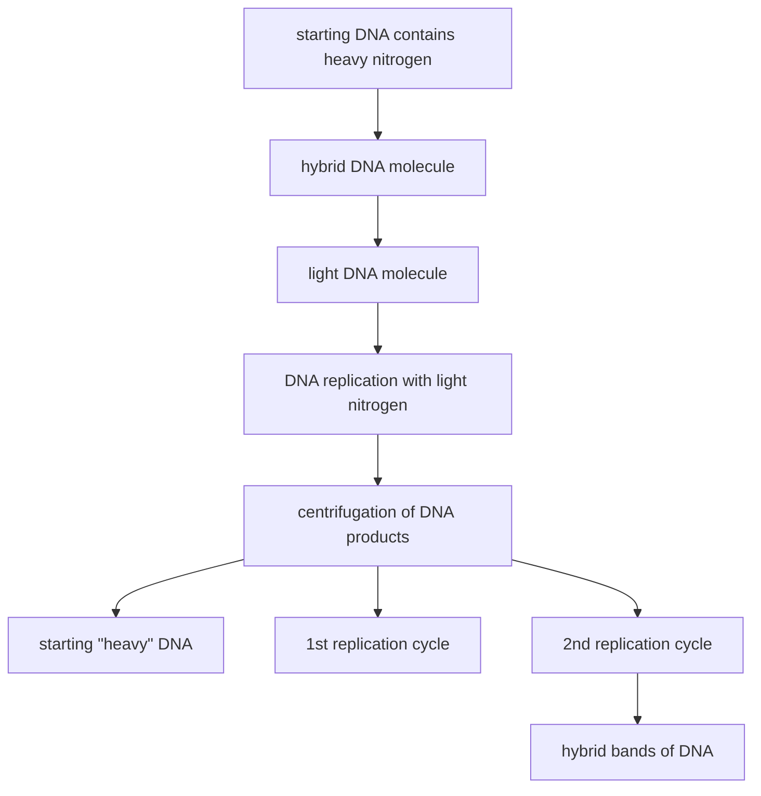


# CHAPTER ONE BEGINNINGS OF GENETICS: FROM MENDEL TO HITLER

My mother, Bonnie Jean, believed in genes. She was proud of her father's Scottish origins, and saw in him the traditional Scottish virtues of honesty, hard work, and thriftiness. She, too, possessed these qualities and felt that they must have been passed down to her from him. His tragic early death meant that her only nongenetic legacy was a set of tiny little girl's kilts he had ordered for her from Glasgow. Perhaps therefore it is not surprising that she valued her father's biological legacy over his material one.

Growing up, I had endless arguments with Mother about the relative roles played by nature and nurture in shaping us. By choosing nurture over nature, I was effectively subscribing to the belief that I could make myself into whatever I wanted to be. I did not want to accept that my genes mattered that much, preferring to attribute my Watson grandmother's extreme fatness to her having overeaten. If her shape was the product of her genes, then I too might have a hefty future. However, even as a teenager, I would not have disputed the evident basics of inheritance, that like begets like. My arguments with my mother concerned complex characteristics

1

2

like aspects of personality, not the simple attributes that, even as an obstinate adolescent, I could see were passed down over the generations, resulting in 鈥渇amily likeness.鈥?My nose is my mother鈥檚 and now belongs to my son Duncan.

3

Sometimes characteristics come and go within a few generations, but sometimes they persist over many. One of the most famous examples of a long-lived trait is known as the 鈥淗apsburg Lip.鈥?This distinctive elongation of the jaw and droopiness to the lower lip鈥攚hich made the Hapsburg rulers of Europe such a nightmare assignment for generations of court portrait painters鈥攚as passed down intact over at least twenty-three generations.

natural_image

Black-and-white photo of three smiling adults outdoors, surrounded by trees and rocks (no text or symbols visible)

At age eleven, with my sister Elizabeth and my father, James

4

The Hapsburgs added to their genetic woes by intermarrying. Arranging marriages between different branches of the Hapsburg clan and often among close relatives may have made political sense as a way of building alliances and ensuring dynastic succession, but it was anything but astute in genetic terms. Inbreeding of this kind can result in genetic disease, as the Hapsburgs found out to their cost. Charles II, the last of the Hapsburg monarchs in Spain, not only boasted a prize-worthy example of the family lip鈥攈e could not even chew his own food鈥攂ut was also a complete invalid, and incapable, despite two marriages, of producing children.

5

Genetic disease has long stalked humanity. In some cases, such as Charles II's, it has had a direct impact on history. Retrospective diagnosis has suggested that

Chapter 1

George III, the English king whose principal claim to fame is to have lost the American colonies in the Revolutionary War, suffered from an inherited disease, porphyria, which causes periodic bouts of madness. Some historians鈥攎ainly British ones鈥攈ave argued that it was the distraction caused by George鈥檚 illness that permitted the Americans鈥?against-the-odds military success. While most hereditary diseases have no such geopolitical impact, they nevertheless have brutal and often tragic consequences for the afflicted families, sometimes for many generations. Understanding genetics is not just about understanding why we look like our parents. It is also about coming to grips with some of humankind鈥檚 oldest enemies: the flaws in our genes that cause genetic disease.

Our ancestors must have wondered about the workings of heredity as soon as evolution endowed them with brains capable of formulating the right kind of question. And the readily observable principle that close relatives tend to be similar can carry you a long way if, like our ancestors, your concern with the application of genetics is limited to practical matters like improving domesticated animals (for, say, milk yield in cattle) and plants (for, say, the size of fruit). Generations of careful selection鈥攂reeding initially to domesticate appropriate species, and then breeding only from the most productive cows and from the trees with the largest fruit鈥攔esulted in animals and plants tailor-made for human purposes. Underlying this enormous unrecorded effort is that simple rule of thumb: that the most productive cows will produce highly productive offspring and from the seeds of trees with large fruit large-fruited trees will grow. Thus, despite the extraordinary advances of the past hundred years or so, the twentieth and twenty-first centuries by no means have a monopoly on genetic insight. Although it wasn鈥檛 until 1909 that the British biologist William Bateson gave the science of inheritance a name, genetics, and although the DNA revolution has opened up new and extraordinary vistas of potential progress, in fact the single greatest application of genetics to human well-being was carried out eons ago by anonymous ancient farmers. Almost everything we eat鈥攃ereals, fruit, meat, dairy products鈥攊s the legacy of that earliest and most far-reaching application of genetic manipulations to human problems.

An understanding of the actual mechanics of genetics proved a tougher nut to crack. Gregor Mendel (1822鈥?884) published his famous paper on the subject in 1866 (and it was ignored by the scientific community for another thirty-four years). Why did it take so long? After all, heredity is a major aspect of the natural world, and, more important, it is readily, and universally, observable: a dog owner sees

6

7

how a cross between a brown and black dog turns out, and all parents consciously or subconsciously track the appearance of their own characteristics in their children. One simple reason is that genetic mechanisms turn out to be complicated. Mendel's solution to the problem is not intuitively obvious: children are not, after all, simply a blend of their parents' characteristics. Perhaps most important was the failure by early biologists to distinguish between two fundamentally different processes, heredity and development. Today we understand that a fertilized egg contains the genetic information, contributed by both parents, that determines whether someone will be afflicted with, say, porphyria. That is heredity. The subsequent process, the development of a new individual from that humble starting point of a single cell, the fertilized egg, involves implementing that information. Broken down in terms of academic disciplines, genetics focuses on the information and developmental biology focuses on the use of that information. Lumping heredity and development together into a single phenomenon, early scientists never asked the questions that might have steered them toward the secret of heredity. Nevertheless, the effort had been under way in some form since the dawn of Western history.

The Greeks, including Hippocrates, pondered heredity. They devised a theory of 鈥減angenesis,鈥?which claimed that sex involved the transfer of miniaturized body parts: 鈥淗airs, nails, veins, arteries, tendons and their bones, albeit invisible as their particles are so small. While growing, they gradually separate from each other.鈥?This idea enjoyed a brief renaissance when Charles Darwin, desperate to support his theory of evolution by natural selection with a viable hypothesis of inheritance, put forward a modified version of pangenesis in the second half of the nineteenth century. In Darwin鈥檚 scheme, each organ鈥攅yes, kidneys, bones鈥攃ontributed circulating 鈥済emmules鈥?that accumulated in the sex organs, and were ultimately exchanged in the course of sexual reproduction. Because these gemmules were produced throughout an organism鈥檚 lifetime, Darwin argued any change that occurred in the individual after birth, like the stretch of a giraffe鈥檚 neck imparted by craning for the highest foliage, could be passed on to the next generation. Ironically, then, to buttress his theory of natural selection Darwin came to champion aspects of Jean-Baptiste Lamarck鈥檚 theory of inheritance of acquired characteristics鈥攖he very theory that his evolutionary ideas did so much to discredit. Darwin was invoking

8

Chapter 1

only Lamarck's theory of inheritance; he continued to believe that natural selection was the driving force behind evolution, but supposed that natural selection operated on the variation produced by pangenesis. Had Darwin known about Mendel's work (although Mendel published his results shortly after The Origin of Species appeared, Darwin was never aware of them), he might have been spared the embarrassment of this late-career endorsement of some of Lamarck's ideas.

Whereas pangenesis supposed that embryos were assembled from a set of minuscule components, another approach, 鈥減reformationism,鈥?avoided the assembly step altogether: either the egg or the sperm (exactly which was a contentious issue) contained a complete preformed individual called a homunculus. Development was therefore merely a matter of enlarging this into a fully formed being. In the days of preformationism, what we now recognize as genetic disease was variously interpreted: sometimes as a manifestation of the wrath of God or the mischief of demons and devils; sometimes as evidence of either an excess of or a deficit of the father鈥檚 鈥渟eed鈥? sometimes as the result of 鈥渨icked thoughts鈥?on the part of the mother during pregnancy. On the premise that fetal malformation can result when a pregnant mother鈥檚 desires are thwarted, leaving her feeling stressed and frustrated, Napoleon passed a law permitting expectant mothers to shoplift. None of these notions, needless to say, did much to advance our understanding of genetic disease.

By the early nineteenth century, better microscopes had defeated preformationism. Look as hard as you like, you will never see a tiny homunculus curled up inside a sperm or egg cell. Pangenesis, though an earlier misconception, lasted rather longer鈥攖he argument would persist that the gemmules were simply too small to visualize鈥攂ut was eventually laid to rest by August Weismann, who argued that inheritance depended on the continuity of germ plasm between generations and thus changes to the body over an individual鈥檚 lifetime could not be transmitted to subsequent generations. His simple experiment involved cutting the tails off several generations of mice. According to Darwin鈥檚 pangenesis, tailless mice would produce gemmules signifying 鈥渘o tail鈥?and so their offspring should develop a severely stunted hind appendage or none at all. When Weismann showed that the tail kept appearing after many generations of amputees, pangenesis bit the dust.

9

10

natural_image

Illustration of a stylized, symmetrical object resembling a biological or decorative form with a central circular top and symmetrical base (no text or symbols)

Genetics before Mendel: a homunculus, a preformed miniature person imagined to exist in the head of a sperm cell

11 Gregor Mendel was the one who got it right. By any standards, however, he was an unlikely candidate for scientific superstardom. Born to a farming family in what is now the Czech Republic, he excelled at the village school and, at twenty-one, entered the Augustinian monastery at Br眉nn. After proving a disaster as a parish priest鈥攈is response to the ministry was a nervous breakdown鈥攈e tried his hand at teaching. By all accounts he was a good teacher, but in order to qualify to teach a full range of subjects, he had to take an exam. He failed it. Mendel鈥檚 father superior, Abbot Napp, then dispatched him to the University of Vienna, where he was to bone up full-time for the retesting. Despite apparently doing well in physics at Vienna, Mendel again failed the exam, and so never rose above the rank of substitute teacher.

Chapter 1

Around 1856, at Abbot Napp's suggestion, Mendel undertook some scientific experiments on heredity. He chose to study a number of characteristics of the pea plants he grew in his own patch of the monastery garden. In 1865 he presented his results to the local natural history society in two lectures, and, a year later, published them in the society's journal. The work was a tour de force: the experiments were brilliantly designed and painstakingly executed, and his analysis of the results was insightful and deft. It seems that his training in physics contributed to his breakthrough because, unlike other biologists of that time, he approached the problem quantitatively. Rather than simply noting that crossbreeding of red and white flowers resulted in some red and some white offspring, Mendel actually counted them, realizing that the ratios of red to white progeny might be significant鈥攁s indeed they are. Despite sending copies of his article to various prominent scientists, Mendel found himself completely ignored by the scientific community. His attempt to draw attention to his results merely backfired. He wrote to his one contact among the ranking scientists of the day, botanist Karl N盲geli in Munich, asking him to replicate the experiments, and he duly sent off 140 carefully labeled packets of seeds. He should not have bothered. N盲geli believed that the obscure monk should be of service to him, rather than the other way around, so he sent Mendel seeds of his own favorite plant, hawkweed, challenging the monk to re-create his results with a different species. Sad to say, for various reasons, hawkweed is not well-suited to breeding experiments such as those Mendel had performed on the peas. The entire exercise was a waste of his time.

12

Mendel鈥檚 low-profile existence as monk-teacher-researcher ended abruptly in 1868 when, on Napp鈥檚 death, he was elected abbot of the monastery. Although he continued his research鈥攊ncreasingly on bees and the weather鈥攁dministrative duties were a burden, especially as the monastery became embroiled in a messy dispute over back taxes. Other factors, too, hampered him as a scientist. Portliness eventually curtailed his fieldwork: as he wrote, hill climbing had become 鈥渧ery difficult for me in a world where universal gravitation prevails.鈥?His doctors prescribed tobacco to keep his weight in check, and he obliged them by smoking twenty cigars a day, as many as Winston Churchill. It was not his lungs, however, that let him down: in 1884, at the age of sixty-one, Mendel succumbed to a combination of heart and kidney disease.

13

Not only were Mendel's results buried in an obscure journal, but they would have been unintelligible to most scientists of the era. He was far ahead of his time

14

with his combination of careful experiment and sophisticated quantitative analysis. Little wonder, perhaps, that it was not until 1900 that the scientific community caught up with him. The rediscovery of Mendel's work, by three plant geneticists interested in similar problems, provoked a revolution in biology. At last the scientific world was ready for the monk's peas.

Mendel realized that there are specific factors鈥攍ater to be called 鈥済enes鈥濃€攖hat are passed from parent to offspring. He worked out that these factors come in pairs and that the offspring receives one from each parent.

Noticing that peas came in two distinct colors, green and yellow, he deduced that there were two versions of the pea-color gene. A pea has to have two copies of the G version if it is to become green, in which case we say that it is GG for the pea-color gene. It must therefore have received a G pea-color gene from both of its parents. However, yellow peas can result both from YY and YG combinations. Having only one copy of the Y version is sufficient to produce yellow peas. Y trumps G. Because in the YG case the Y signal dominates the G signal, we call Y 鈥渄ominant.鈥?The subordinate G version of the pea-color gene is called 鈥渞ecessive.鈥?
Each parent pea plant has two copies of the pea-color gene, yet it contributes only one copy to each offspring; the other copy is furnished by the other parent. In plants, pollen grains contain sperm cells鈥攖he male contribution to the next generation鈥攁nd each sperm cell contains just one copy of the pea-color gene. A parent pea plant with a YG combination will produce sperm that contain either a Y version or a G one. Mendel discovered that the process is random: 50 percent of the sperm produced by that plant will have a Y and 50 percent will have a G.

Suddenly many of the mysteries of heredity made sense. Characteristics, like the Hapsburg Lip, that are transmitted with a high probability (actually 50 percent) from generation to generation are dominant. Other characteristics that appear in family trees much more sporadically, often skipping generations, may be recessive. When a gene is recessive an individual has to have two copies of it for the corresponding trait to be expressed. Those with one copy of the gene are carriers: they don鈥檛 themselves exhibit the characteristic, but they can pass the gene on. Albinism, in which the body fails to produce pigment so the skin and hair are strikingly white, is an example of a recessive characteristic that is transmitted in this way. Therefore, to be albino you have to have two copies of the gene, one from each parent. (This was the case with the Reverend Dr. William Archibald

Chapter 1

Spooner, who was also鈥攑erhaps only by coincidence鈥攑rone to a peculiar form of linguistic confusion whereby, for example, 鈥渁 well-oiled bicycle鈥?might become 鈥渁 well-boiled icicle.鈥?Such reversals would come to be termed 鈥渟poonerisms鈥?in his honor.) Your parents, meanwhile, may have shown no sign of the gene at all. If, as is often the case, each has only one copy, then they are both carriers. The trait has skipped at least one generation.

Mendel's results implied that things鈥攎aterial objects鈥攚ere transmitted from generation to generation. But what was the nature of these things?

At about the time of Mendel's death in 1884, scientists using ever-improving optics to study the minute architecture of cells coined the term 鈥渃hromosome鈥?to describe the long stringy bodies in the cell nucleus. But it was not until 1902 that Mendel and chromosomes came together.

natural_image

Microscopic view of rod-shaped bacterial cells (no visible text or labels)

The human X chromosome, as seen with an electron microscope

A medical student at Columbia University, Walter Sutton, realized that chromosomes had a lot in common with Mendel's mysterious factors. Studying grasshopper chromosomes, Sutton noticed that most of the time they are doubled up鈥攋ust like Mendel's paired factors. But Sutton also identified one type of cell in which chromosomes were not paired: the sex cells. Grasshopper sperm have only a single set of chromosomes, not a double set. This was exactly what Mendel had described: his pea plant sperm cells also only carried a single copy of each of his factors. It was clear that Mendel's factors, now called genes, must be on the chromosomes.

21

In Germany Theodor Boveri independently came to the same conclusions as Sutton, and so the biological revolution their work had precipitated came to be called the Sutton-Boveri chromosome theory of inheritance. Suddenly genes were real. They were on chromosomes, and you could actually see chromosomes through the microscope.

Not everyone bought the Sutton-Boveri theory. One skeptic was Thomas Hunt Morgan, also at Columbia. Looking down the microscope at those stringy chromosomes, he could not see how they could account for all the changes that occur from one generation to the next. If all the genes were arranged along chromosomes, and all chromosomes were transmitted intact from one generation to the next, then surely many characteristics would be inherited together. But since empirical evidence showed this not to be the case, the chromosomal theory seemed insufficient to explain the variation observed in nature. Being an astute experimentalist, however, Morgan had an idea how he might resolve such discrepancies. He turned to the fruit fly, Drosophila melanogaster, the drab little beast that, ever since Morgan, has been so beloved by geneticists.

natural_image

Black-and-white photo of a man in a suit examining glassware in a laboratory setting (no visible text or symbols)

Notoriously camera shy T. H. Morgan was photographed surreptitiously while at work in the fly room.

Chapter 1

In fact, Morgan was not the first to use the fruit fly in breeding experiments鈥攖hat distinction belonged to a lab at Harvard that first put the critter to work in 1901鈥攂ut it was Morgan鈥檚 work that put the fly on the scientific map. Drosophila is a good choice for genetic experiments. It is easy to find (as anyone who has left out a bunch of overripe bananas during the summer well knows); it is easy to raise (bananas will do as feed); and you can accommodate hundreds of flies in a single milk bottle (Morgan鈥檚 students had no difficulty acquiring milk bottles, pinching them at dawn from doorsteps in their Manhattan neighborhood); and it breeds and breeds and breeds (a whole generation takes about ten days, and each female lays several hundred eggs). Starting in 1907 in a famously squalid, cockroach-infested, banana-stinking lab that came to be known affectionately as the 鈥渇ly room,鈥?Morgan and his students (鈥淢organ鈥檚 boys鈥?as they were called) set to work on fruit flies.

Unlike Mendel, who could rely on the variant strains isolated over the years by farmers and gardeners鈥攜ellow peas as opposed to green ones, wrinkled skin as opposed to smooth鈥擬organ had no menu of established genetic differences in the fruit fly to draw upon. And you cannot do genetics until you have isolated some distinct characteristics to track through the generations. Morgan鈥檚 first goal therefore was to find 鈥渕utants,鈥?the fruit fly equivalents of yellow or wrinkled peas. He was looking for genetic novelties, random variations that somehow simply appeared in the population.

One of the first mutants Morgan observed turned out to be one of the most instructive. While normal fruit flies have red eyes, these had white ones. And he noticed that the white-eyed flies were typically male. It was known that the sex of a fruit fly鈥攐r, for that matter, the sex of a human鈥攊s determined chromosomally: females have two copies of the X chromosome, whereas males have one copy of the X and one copy of the much smaller Y. In light of this information, the white-eye result suddenly made sense: the eye-color gene is located on the X chromosome and the white-eye mutation, W, is recessive. Because males have only a single X chromosome, even recessive genes, in the absence of a dominant counterpart to suppress them, are automatically expressed. White-eyed females were relatively rare because they typically had only one copy of W so they expressed the dominant red eye color. By correlating a gene鈥攖he one for eye color鈥攚ith a chromosome, the X, Morgan, despite his initial reservations, had effectively proved the Sutton-Boveri theory. He had also found an example of 鈥渟ex-linkage,鈥?in which a particular characteristic is disproportionately represented in one sex.

24

25

26

27

Like Morgan鈥檚 fruit flies, Queen Victoria provides a famous example of sex-linkage. On one of her X chromosomes, she had a mutated gene for hemophilia, the 鈥渂leeding disease鈥?in whose victims proper blood clotting fails to occur. Because her other copy was normal, and the hemophilia gene is recessive, she herself did not have the disease. But she was a carrier. Her daughters did not have the disease either; evidently each possessed at least one copy of the normal version. But Victoria鈥檚 sons were not all so lucky. Like all males (fruit fly males included), each had only one X chromosome; this was necessarily derived from Victoria (a Y chromosome could have come only from Prince Albert, Victoria鈥檚 husband). Because Victoria had one mutated copy and one normal copy, each of her sons had a 50-50 chance of having the disease. Prince Leopold drew the short straw: he developed hemophilia, and died at thirty-one, bleeding to death after a minor fall. Two of Victoria鈥檚 daughters, Princesses Alice and Beatrice, were carriers, having inherited the mutated gene from their mother. They each produced carrier daughters and sons with hemophilia. Alice鈥檚 grandson Alexis, heir to the Russian throne, had hemophilia, and would doubtless have died young had the Bolsheviks not gotten to him first.

28

Morgan鈥檚 fruit flies had other secrets to reveal. In the course of studying genes located on the same chromosome, Morgan and his students found that chromosomes actually break apart and re-form during the production of sperm and egg cells. This meant that Morgan鈥檚 original objections to the Sutton-Boveri theory were unwarranted: the breaking and re-forming鈥斺€渞ecombination,鈥?in modern genetic parlance鈥攕huffles gene copies between members of a chromosome pair. This means that, say, the copy of chromosome 12 I got from my mother (the other, of course, comes from my father) is in fact a mix of my mother鈥檚 two copies of chromosome 12, one of which came from her mother and one from her father. Her two 12s recombined鈥攅xchanged material鈥攄uring the production of the egg cell that eventually turned into me. Thus my maternally derived chromosome 12 can be viewed as a mosaic of my grandparents鈥?12s. Of course, my mother鈥檚 maternally derived 12 was itself a mosaic of her grandparents鈥?12s, and so on.

29

Recombination permitted Morgan and his students to map out the positions of particular genes along a given chromosome. Recombination involves breaking (and re-forming) chromosomes. Because genes are arranged like beads along a chromosome string, a break is statistically much more likely to occur between

Chapter 1

two genes that are far apart (with more potential break points intervening) on the chromosome than between two genes that are close together. If, therefore, we see a lot of reshuffling for any two genes on a single chromosome, we can conclude that they are a long way apart; the rarer the reshuffling, the closer the genes likely are. This basic and immensely powerful principle underlies all of genetic mapping. One of the primary tools of scientists involved in the Human Genome Project and of researchers at the forefront of the battle against genetic disease was thus developed all those years ago in the filthy, cluttered Columbia fly room. Each new headline in the science section of the newspaper these days along the lines of 鈥淕ene for Something Located鈥?is a tribute to the pioneering work of Morgan and his boys.

The rediscovery of Mendel鈥檚 work, and the breakthroughs that followed it, sparked a surge of interest in the social significance of genetics. While scientists had been grappling with the precise mechanisms of heredity through the eighteenth and nineteenth centuries, public concern had been mounting about the burden placed on society by what came to be called the 鈥渄egenerate classes鈥濃€攖he inhabitants of poorhouses, workhouses, and insane asylums. What could be done with these people? It remained a matter of controversy whether they should be treated charitably鈥攚hich, the less charitably inclined claimed, ensured such folk would never exert themselves and would therefore remain forever dependent on the largesse of the state or of private institutions鈥攐r whether they should be simply ignored, which, according to the charitably inclined, would result only in perpetuating the inability of the unfortunate to extricate themselves from their blighted circumstances.

The publication of Darwin鈥檚 Origin of Species in 1859 brought these issues into sharp focus. Although Darwin carefully omitted to mention human evolution, fearing that to do so would only further inflame an already raging controversy, it required no great leap of imagination to apply his idea of natural selection to humans. Natural selection is the force that determines the fate of all genetic variations in nature鈥攎utations like the one Morgan found in the fruit fly eye-color gene, but also perhaps differences in the abilities of human individuals to fend for themselves.

Natural populations have an enormous reproductive potential. Take fruit flies, with their generation time of just ten days, and females that produce some three hundred eggs apiece (half of which will be female): starting with a single fruit fly

30

31

32

couple, after a month (i.e., three generations later), you will have $150 \times 150 \times 150$ fruit flies on your hands鈥攖hat's more than 3 million flies, all of them derived from just one pair in just one month. Darwin made the point by choosing a species from the other end of the reproductive spectrum:

The elephant is reckoned to be the slowest breeder of all known animals, and I have taken some pains to estimate its probable minimum rate of natural increase: it will be under the mark to assume that it breeds when thirty years old, and goes on breeding till ninety years old, bringing forth three pairs of young in this interval; if this be so, at the end of the fifth century there would be alive fifteen million elephants, descended from the first pair.

33

All these calculations assume that all the baby fruit flies and all the baby elephants make it successfully to adulthood. In theory, therefore, there must be an infinitely large supply of food and water to sustain this kind of reproductive overdrive. In reality, of course, those resources are limited, and not all baby fruit flies or baby elephants make it. There is competition among individuals within a species for those resources. What determines who wins the struggle for access to the resources? Darwin pointed out genetic variation means that some individuals have advantages in what he called 鈥渢he struggle for existence.鈥?To take the famous example of Darwin鈥檚 finches from the Gal谩pagos Islands, those individuals with genetic advantages鈥攍ike the right size of beak for eating the most abundant seeds鈥攁re more likely to survive and reproduce. So the advantageous genetic variant鈥攈aving a bill the right size鈥攖ends to be passed on to the next generation. The result is that natural selection enriches the next generation with the beneficial mutation so that eventually, over enough generations, every member of the species ends up with that characteristic.

34

The Victorians applied the same logic to humans. They looked around and were alarmed by what they saw. The decent, moral, hardworking middle classes were being massively outreproduced by the dirty, immoral, lazy lower classes. The Victorians assumed that the virtues of decency, morality, and hard work ran in families just as the vices of filth, wantonness, and indolence did. Such characteristics must then be hereditary; thus, to the Victorians, morality and immorality were merely

Chapter 1

two of Darwin's genetic variants. And if the great unwashed were outreproducing the respectable classes, then the 鈥渂ad鈥?genes would be increasing in the human population. The species was doomed! Humans would gradually become more and more depraved as the 鈥渋mmorality鈥?gene became more and more common.

Francis Galton had good reason to pay special attention to Darwin鈥檚 book, as the author was his cousin and friend. Darwin, some thirteen years older, had provided guidance during Galton鈥檚 rather rocky college experience. But it was The Origin of Species that would inspire Galton to start a social and genetic crusade that would ultimately have disastrous consequences. In 1883, a year after his cousin鈥檚 death, Galton gave the movement a name: eugenics.

Eugenics was only one of Galton鈥檚 many interests; Galton enthusiasts refer to him as a polymath, detractors as a dilettante. In fact, he made significant contributions to geography, anthropology, psychology, genetics, meteorology, statistics, and, by setting fingerprint analysis on a sound scientific footing, to criminology. Born in 1822 into a prosperous family, his education鈥攑artly in medicine and partly in mathematics鈥攚as mostly a chronicle of defeated expectations. The death of his father when he was twenty-one simultaneously freed him from paternal restraint and yielded a handsome inheritance; the young man duly took advantage of both. After a full six years of being what might be described today as a trust-fund dropout, however, Galton settled down to become a productive member of the Victorian establishment. He made his name leading an expedition to a then little known region of southwest Africa in 1850鈥?2. In his account of his explorations, we encounter the first instance of the one strand that connects his many varied interests: he counted and measured everything. Galton was only happy when he could reduce a phenomenon to a set of numbers.

At a missionary station he encountered a striking specimen of steatopygia鈥攁 condition of particularly protuberant buttocks, common among the indigenous Nama women of the region鈥攁nd realized that this woman was naturally endowed with the figure that was then fashionable in Europe. The only difference was that it required enormous (and costly) ingenuity on the part of European dressmakers to create the desired 鈥渓ook鈥?for their clients.

I profess to be a scientific man, and was exceedingly anxious to obtain accurate measurements of her shape; but there was a difficulty in doing

35

36

37

# 112 鑸囪嚜鐒跺皪瑭?In Dialogue with Nature

this. I did not know a word of Hottentot [the Dutch name for the Nama], and could never therefore have explained to the lady what the object of my footrule could be; and I really dared not ask my worthy missionary host to interpret for me. I therefore felt in a dilemma as I gazed at her form, that gift of bounteous nature to this favoured race, which no mantua-maker, with all her crinoline and stuffing, can do otherwise than humbly imitate. The object of my admiration stood under a tree, and was turning herself about to all points of the compass, as ladies who wish to be admired usually do. Of a sudden my eye fell upon my sextant; the bright thought struck me, and I took a series of observations upon her figure in every direction, up and down, crossways, diagonally, and so forth, and I registered them carefully upon an outline drawing for fear of any mistake; this being done, I boldly pulled out my measuring tape, and measured the distance from where I was to the place she stood, and having thus obtained both base and angles, I worked out the results by trigonometry and logarithms.

natural_image

Illustration of a person in traditional attire holding a staff, depicted in profile with no visible text or symbols

SARTLEE, THE HOTTENTOT VENUS.
NOW Exhibiting in London.
Drawn from Life

# A nineteenth-century exaggerated view of a Nama woman

38

Galton's passion for quantification resulted in his developing many of the fundamental principles of modern statistics. It also yielded some clever observations. For example, he tested the efficacy of prayer. He figured that if prayer worked,

Chapter 1

those most prayed for should be at an advantage; to test the hypothesis he studied the longevity of British monarchs. Every Sunday, congregations in the Church of England following the Book of Common Prayer beseeched God to 鈥淓ndue the king/queen plenteously with heavenly gifts; Grant him/her in health and wealth long to live.鈥?Surely, Galton reasoned, the cumulative effect of all those prayers should be beneficial. In fact, prayer seemed ineffectual: he found that on average the monarchs died somewhat younger than other members of the British aristocracy.

Because of the Darwin connection鈥攖heir common grandfather, Erasmus Darwin, too was one of the intellectual giants of his day鈥擥alton was especially sensitive to the way in which certain lineages seemed to spawn disproportionately large numbers of prominent and successful people. In 1869 he published what would become the underpinning of all his ideas on eugenics, a treatise called Hereditary Genius: An Inquiry into Its Laws and Consequences. In it he purported to show that talent, like simple genetic traits such as the Hapsburg Lip, does indeed run in families; he recounted, for example, how some families had produced generation after generation of judges. His analysis largely neglected to take into account the effect of the environment: the son of a prominent judge is, after all, rather more likely to become a judge鈥攂y virtue of his father鈥檚 connections, if nothing else鈥攖han the son of a peasant farmer. Galton did not, however, completely overlook the effect of the environment, and it was he who first referred to the 鈥渘ature/nurture鈥?dichotomy, possibly in reference to Shakespeare鈥檚 irredeemable villain, Caliban, 鈥渁 devil, a born devil, on whose nature/Nurture can never stick.鈥?
39

The results of his analysis, however, left no doubt in Galton's mind.

40

I have no patience with the hypothesis occasionally expressed, and often implied, especially in tales written to teach children to be good, that babies are born pretty much alike, and that the sole agencies in creating differences between boy and boy, and man and man, are steady application and moral effort. It is in the most unqualified manner that I object to pretensions of natural equality.

A corollary of his conviction that these traits are genetically determined, he argued, was that it would be possible to 鈥渋mprove鈥?the human stock by preferentially breeding gifted individuals, and preventing the less gifted from reproducing.

41

# 114 鑸囪嚜鐒跺皪瑭?In Dialogue with Nature

It is easy . . . to obtain by careful selection a permanent breed of dogs or horses gifted with peculiar powers of running, or of doing anything else, so it would be quite practicable to produce a highly-gifted race of men by judicious marriages during several consecutive generations.

42

Galton introduced the terms eugenics (literally 鈥済ood in birth鈥? to describe this application of the basic principle of agricultural breeding to humans. In time, eugenics came to refer to 鈥渟elf-directed human evolution鈥? by making conscious choices about who should have children, eugenicists believed that they could head off the 鈥渆ugenic crisis鈥?precipitated in the Victorian imagination by the high rates of reproduction of inferior stock coupled with the typically small families of the superior middle classes.

[...]

DNA   

text_image

EUGENICS
EUGENICS IS THE
SELF DIRECTION
OF HUMAN EVOLUTION
GENETICS
PHYSIOLOGY BIOLOGY
PSYCHOLOGY
MENTAL TESTING
ANTHROPOMETRY
HISTORY
GEOLOGY
ARCHEDIOLOGY
ANTHROPOLOGY
ETHIOLOGY
LAV
STATISTICS
BIOPGRAPHY
ECONOPROS
POLITICS
MEDICINE
SURGERY
PSYCHINISTRY
SOCIOLOGY RELIGION
HONORIATION
LIKE A TREE

EUCENICS DRAWS ITS MATERIALS FROM MANY SOURCES AND ORGANIZES
THEM INTO AN HARMONIOUS ENTITY.

Eugenics as it was perceived during the first part of the twentieth century: an opportunity for humans to control their own evolutionary destiny

Chapter 2

# CHAPTER TWO THE DOUBLE HELIX: THIS IS LIFE

I got hooked on the gene during my third year at the University of Chicago. Until then, I had planned to be a naturalist and looked forward to a career far removed from the urban bustle of Chicago鈥檚 South Side, where I grew up. My change of heart was inspired not by an unforgettable teacher but a little book that appeared in 1944, What Is Life?, by the Austrian-born father of wave mechanics, Erwin Schr枚dinger. It grew out of several lectures he had given the year before at the Institute for Advanced Study in Dublin. That a great physicist had taken the time to write about biology caught my fancy. In those days, like most people, I considered chemistry and physics to be the 鈥渞eal鈥?sciences, and theoretical physicists were science鈥檚 top dogs.

Schr枚dinger argued that life could be thought of in terms of storing and passing on biological information. Chromosomes were thus simply information bearers. Because so much information had to be packed into every cell, it must be compressed into what Schr枚dinger called a 鈥渉ereditary code-script鈥?embedded in the molecular fabric of chromosomes. To understand life, then, we would have to identify these molecules, and crack their code. He even speculated that understanding life鈥攚hich would involve finding the gene鈥攎ight take us beyond the laws of physics as we then understood them. Schr枚dinger鈥檚 book was tremendously influential. Many of those who would become major players in Act 1 of molecular biology鈥檚 great drama, including Francis Crick (a former physicist himself), had, like me, read What Is Life? and been impressed.

In my own case, Schr枚dinger struck a chord because I too was intrigued by the essence of life. A small minority of scientists still thought life depended upon a vital force emanating from an all-powerful god. But like most of my teachers, I disdained the very idea of vitalism. If such a 鈥渧ital鈥?force were calling the shots in nature鈥檚 game, there was little hope life would ever be understood through the methods of science. On the other hand, the notion that life might be perpetuated by means of an instruction book inscribed in a secret code appealed to me. What sort of molecular code could be so elaborate as to convey all the multitudinous wonder of the living world? And what sort of molecular trick could ensure that the code is exactly copied every time a chromosome duplicates?

1

2

3

4

At the time of Schr枚dinger's Dublin lectures, most biologists supposed that proteins would eventually be identified as the primary bearers of genetic instruction. Proteins are molecular chains built up from twenty different building blocks, the amino acids. Because permutations in the order of amino acids along the chain are virtually infinite, proteins could, in principle, readily encode the information underpinning life's extraordinary diversity. DNA then was not considered a serious candidate for the bearer of code-scripts, even though it was exclusively located on chromosomes and had been known about for some seventy-five years. In 1869, Friedrich Miescher, a Swiss biochemist working in Germany, had isolated from pus-soaked bandages supplied by a local hospital a substance he called 鈥渘uclein.鈥?Because pus consists largely of white blood cells, which, unlike red blood cells, have nuclei and therefore DNA-containing chromosomes, Miescher had stumbled on a good source of DNA. When he later discovered that 鈥渘uclein鈥?was to be found in chromosomes alone, Miescher understood that his discovery was indeed a big one. In 1893, he wrote: 鈥淚nheritance insures a continuity in form from generation to generation that lies even deeper than the chemical molecule. It lies in the structuring atomic groups. In this sense, I am a supporter of the chemical heredity theory.鈥?

natural_image

Portrait of a man wearing glasses and formal attire (no visible text or symbols)

The physicist Erwin Schr枚dinger, whose book What Is Life? turned me on to the gene

5

Nevertheless, for decades afterward, chemistry would remain unequal to the task of analyzing the immense size and complexity of the DNA molecule. Only

Chapter 2

in the 1930s was DNA shown to be a long molecule containing four different chemical bases: adenine (A), guanine (G), thymine (T), and cytosine (C). But at the time of Schr枚dinger's lectures, it was still unclear just how the subunits (called deoxynucleotides) of the molecule were chemically linked. Nor was it known whether DNA molecules might vary in their sequences of the four different bases. If DNA were indeed Schr枚dinger's code-script, then the molecule would have to be capable of existing in an immense number of different forms. But back then it was still considered a possibility that one simple sequence like AGTC might be repeated over and over along the entire length of DNA chains.

DNA did not move into the genetic limelight until 1944, when Oswald Avery's lab at the Rockefeller Institute in New York City reported that the composition of the surface coats of pneumonia bacteria could be changed. This was not the result he and his junior colleagues, Colin MacLeod and Maclyn McCarty, expected.

For more than a decade Avery鈥檚 group had been following up on another most unexpected observation made in 1928 by Fred Griffith, a scientist in the British Ministry of Health. Griffith was interested in pneumonia and studied its bacterial agent, Pneumococcus. It was known that there were two strains, designated 鈥渟mooth鈥?(S) and 鈥渞ough鈥?(R) according to their appearance under the microscope. These strains differed not only visually but also in their virulence. Inject S bacteria into a mouse, and within a few days the mouse dies; inject R bacteria and the mouse remains healthy. It turns out that S bacterial cells have a coating that prevents the mouse鈥檚 immune system from recognizing the invader. The R cells have no such coating and are therefore readily attacked by the mouse鈥檚 immune defenses.

6

7

natural_image

Microscopic view of blood cells with visible blood vessels (no text or labels)

A view through the microscope of blood cells treated with a chemical that stains DNA. In order to maximize their oxygen-transporting capacity, red blood cells have no nucleus and therefore no DNA. But white blood cells, which patrol the bloodstream in search of intruders, have a nucleus containing chromosomes.

8

Through his involvement with public health, Griffith knew that multiple strains had sometimes been isolated from a single patient, and so he was curious about how different strains might interact in his unfortunate mice. With one combination, he made a remarkable discovery: when he injected heat-killed S bacteria (harmless) and normal R bacteria (also harmless), the mouse died. How could two harmless forms of bacteria conspire to become lethal? The clue came when he isolated the Pneumococcus bacteria retrieved from the dead mice and discovered living S bacteria. It appeared the living innocuous R bacteria had acquired something from the dead S variant; whatever it was, that something had allowed the R in the presence of the heat-killed S bacteria to transform itself into a living killer S strain. Griffith confirmed that this change was for real by culturing the S bacteria from the dead mouse over several generations: the bacteria bred true for the S type, just as any regular S strain would. A genetic change had indeed occurred to the R bacteria injected into the mouse.

9

Though this transformation phenomenon seemed to defy all understanding, Griffith's observations at first created little stir in the scientific world. This was partly because Griffith was intensely private and so averse to large gatherings that he seldom attended scientific conferences. Once, he had to be virtually forced to give a lecture. Bundled into a taxi and escorted to the hall by colleagues, he discoursed in a mumbled monotone, emphasizing an obscure corner of his microbiological work but making no mention of bacterial transformation. Luckily, however, not everyone overlooked Griffith's breakthrough.

10

Oswald Avery was also interested in the sugarlike coats of the Pneumococcus. He set out to duplicate Griffith's experiment in order to isolate and characterize whatever it was that had caused those R cells to change to the S type. In 1944 Avery, MacLeod, and McCarty published their results: an exquisite set of experiments showing unequivocally that DNA was the transforming principle. Culturing the bacteria in the test tube rather than in mice made it much easier to search for the chemical identity of the transforming factor in the heat-killed S cells. Methodically destroying one by one the biochemical components of the heat-treated S cells, Avery and his group looked to see whether transformation was prevented. First they degraded the sugarlike coat of the S bacteria. Transformation still occurred: the coat was not the transforming principle. Next they used a mixture of two protein-destroying enzymes, trypsin and chymotrypsin, to degrade virtually all the proteins

Chapter 2

in the S cells. To their surprise, transformation was again unaffected. Next they tried an enzyme (RNase) that breaks down RNA (ribonucleic acid), a second class of nucleic acids similar to DNA and possibly involved in protein synthesis. Again transformation occurred. Finally, they came to DNA, exposing the S bacterial extracts to the DNA-destroying enzyme, DNase. This time they hit a home run. All S-inducing activity ceased completely. The transforming factor was DNA.

In part because of its bombshell implications, the resulting February 1944 paper by Avery, MacLeod, and McCarty met with a mixed response. Many geneticists accepted their conclusions. After all, DNA was found on every chromosome; why shouldn't it be the genetic material? By contrast, however, most biochemists expressed doubt that DNA was a complex enough molecule to act as the repository of such a vast quantity of biological information. They continued to believe that proteins, the other component of chromosomes, would prove to be the hereditary substance. In principle, as the biochemists rightly noted, it would be much easier to encode a vast body of complex information using the twenty-letter amino-acid alphabet of proteins than the four-letter nucleotide alphabet of DNA. Particularly vitriolic in his rejection of DNA as the genetic substance was Avery's own colleague at the Rockefeller Institute, the protein chemist Alfred Mirsky. By then, however, Avery was no longer scientifically active. The Rockefeller Institute had mandatorily retired him at age sixty-five.

Avery missed out on more than the opportunity to defend his work against the attacks of his colleagues: He was never awarded the Nobel Prize, which was certainly his due, for identifying DNA as the transforming principle. Because the Nobel committee makes its records public fifty years following each award, we now know that Avery鈥檚 candidacy was blocked by the Swedish physical chemist Einar Hammarsten. Though Hammarsten鈥檚 reputation was based largely on his having produced DNA samples of unprecedented high quality, he still believed genes to be an undiscovered class of proteins. In fact, even after the double helix was found, Hammarsten continued to insist that Avery should not receive the prize until after the mechanism of DNA transformation had been completely worked out. Avery died in 1955; had he lived only a few more years, he would almost certainly have gotten the prize.

When I arrived at Indiana University in the fall of 1947 with plans to pursue the gene for my Ph.D. thesis, Avery鈥檚 paper came up over and over in conversations.

11

12

13

By then, no one doubted the reproducibility of his results, and more recent work coming out of the Rockefeller Institute made it all the less likely that proteins would prove to be the genetic actors in bacterial transformation. DNA had at last become an important objective for chemists setting their sights on the next breakthrough. In Cambridge, England, the canny Scottish chemist Alexander Todd rose to the challenge of identifying the chemical bonds that linked together nucleotides in DNA. By early 1951, his lab had proved that these links were always the same, such that the backbone of the DNA molecule was very regular. During the same period, the Austrian-born refugee Erwin Chargaff, at the College of Physicians and Surgeons of Columbia University, used the new technique of paper chromatography to measure the relative amounts of the four DNA bases in DNA samples extracted from a variety of vertebrates and bacteria. While some species had DNA in which adenine and thymine predominated, others had DNA with more guanine and cytosine. The possibility thus presented itself that no two DNA molecules had the same composition.

14

At Indiana I joined a small group of visionary scientists, mostly physicists and chemists, studying the reproductive process of the viruses that attack bacteria (bacteriophages鈥斺€減hages鈥?for short). The Phage Group was born when my Ph.D. supervisor, the Italian-trained medic Salvador Luria and his close friend, the German-born theoretical physicist Max Delbr眉ck, teamed up with the American physical chemist Alfred Hershey. During World War II both Luria and Delbr眉ck were considered enemy aliens, and thus ineligible to serve in the war effort of American science, even though Luria, a Jew, had been forced to leave France for New York City and Delbr眉ck had fled Germany as an objector to Nazism. Thus excluded, they continued to work in their respective university labs鈥擫uria at Indiana and Delbr眉ck at Vanderbilt鈥攁nd collaborated on phage experiments during successive summers at Cold Spring Harbor. In 1943, they joined forces with the brilliant but taciturn Hershey, then doing phage research of his own at Washington University in St. Louis.

15

The Phage Group's program was based on its belief that phages, like all viruses, were in effect naked genes. This concept had first been proposed in 1922 by the imaginative American geneticist Herman J. Muller, who three years later demonstrated that X rays cause mutations. His belated Nobel Prize came in 1946, just after he joined the faculty of Indiana University. It was his presence, in fact, that

Chapter 2

led me to Indiana. Having started his career under T.H. Morgan, Muller knew better than anyone else how genetics had evolved during the first half of the twentieth century, and I was enthralled by his lectures during my first term. His work on fruit flies (Drosophila), however, seemed to me to belong more to the past than to the future, and I only briefly considered doing thesis research under his supervision. I opted instead for Luria's phages, an even speedier experimental subject than Drosophila: genetic crosses of phages done one day could be analyzed the next.

For my Ph.D. thesis research, Luria had me follow in his footsteps by studying how X rays killed phage particles. Initially I had hoped to show that viral death was caused by damage to phage DNA. Reluctantly, however, I eventually had to concede that my experimental approach could never give unambiguous answers at the chemical level. I could draw only biological conclusions. Even though phages were indeed effectively naked genes, I realized that the deep answers the Phage Group was seeking could be arrived at only through advanced chemistry. DNA somehow had to transcend its status as an acronym; it had to be understood as a molecular structure in all its chemical detail.

Upon finishing my thesis, I saw no alternative but to move to a lab where I could study DNA chemistry. Unfortunately, however, knowing almost no pure chemistry, I would have been out of my depth in any lab attempting difficult experiments in organic or physical chemistry. I therefore took a postdoctoral fellowship in the Copenhagen lab of the biochemist Herman Kalckar in the fall of 1950. He was studying the synthesis of the small molecules that make up DNA, but I figured out quickly that his biochemical approach would never lead to an understanding of the essence of the gene. Every day spent in his lab would be one more day's delay in learning how DNA carried genetic information.

My Copenhagen year nonetheless ended productively. To escape the cold Danish spring, I went to the Zoological Station at Naples during April and May. During my last week there, I attended a small conference on X-ray diffraction methods for determining the 3-D structure of molecules. X-ray diffraction is a way of studying the atomic structure of any molecule that can be crystallized. The crystal is bombarded with X rays, which bounce off its atoms and are scattered. The scatter pattern gives information about the structure of the molecule but, taken alone, is not enough to solve the structure. The additional information needed is the 鈥減hase assignment,鈥?which deals with the wave properties of the molecule. Solving

16

17

18

the phase problem was not easy, and at that time only the most audacious scientists were willing to take it on. Most of the successes of the diffraction method had been achieved with relatively simple molecules.

19

My expectations for the conference were low. I believed that a three-dimensional understanding of protein structure, or for that matter of DNA, was more than a decade away. Disappointing earlier X-ray photos suggested that DNA was particularly unlikely to yield up its secrets via the X-ray approach. These results were not surprising since the exact sequences of DNA were expected to differ from one individual molecule to another. The resulting irregularity of surface configurations would understandably prevent the long thin DNA chains from lying neatly side by side in the regular repeating patterns required for X-ray analysis to be successful.

20

It was therefore a surprise and a delight to hear the last-minute talk on DNA by a thirty-four-year-old Englishman named Maurice Wilkins from the Biophysics Lab of King's College, London. Wilkins was a physicist who during the war had worked on the Manhattan Project. For him, as for many of the other scientists involved, the actual deployment of the bomb on Hiroshima and Nagasaki, supposedly the culmination of all their work, was profoundly disillusioning.

natural_image

Black-and-white photo of a man in a suit operating a mechanical device with wires (no visible text or symbols)

Maurice Wilkins in his lab at King's College, London

Chapter 2

He considered forsaking science altogether to become a painter in Paris, but biology intervened. He too had read Schr枚dinger's book, and was now tackling DNA with X-ray diffraction.

He displayed a photograph of an X-ray diffraction pattern he had recently obtained, and its many precise reflections indicated a highly regular crystalline packing. DNA, one had to conclude, must have a regular structure, the elucidation of which might well reveal the nature of the gene. Instantly I saw myself moving to London to help Wilkins find the structure. My attempts to converse with him after his talk, however, went nowhere. All I got for my efforts was a declaration of his conviction that much hard work lay ahead.

While I was hitting consecutive dead ends, back in America the world's preeminent chemist, Caltech's Linus Pauling, announced a major triumph: he had found the exact arrangement in which chains of amino acids (called polypeptides) fold up in proteins, and called his structure the 伪-helix (alpha helix). That it was Pauling who made this breakthrough was no surprise: he was a scientific superstar. His book The Nature of the Chemical Bond essentially laid the foundation of modern chemistry, and, for chemists of the day, it was the Bible. Pauling had been a precocious child. When he was nine, his father, a druggist in Oregon, wrote to the Oregonian newspaper requesting suggestions of reading matter for his bookish son, adding that he had already read the Bible and Darwin's Origin of Species. But the early death of Pauling's father, which brought the family to financial ruin, makes it remarkable that the promising young man managed to get an education at all.

As soon as I returned to Copenhagen I read about Pauling's $\alpha$ -helix. To my surprise, his model was not based on a deductive leap from experimental X-ray diffraction data. Instead, it was Pauling's long experience as a structural chemist that had emboldened him to infer which type of helical fold would be most compatible with the underlying chemical features of the polypeptide chain. Pauling made scale models of the different parts of the protein molecule, working out plausible schemes in three dimensions. He had reduced the problem to a kind of three-dimensional jigsaw puzzle in a way that was simple yet brilliant.

Whether the $\alpha$ -helix was correct鈥攊n addition to being pretty鈥攚as now the question. Only a week later, I got the answer. Sir Lawrence Bragg, the English inventor of X-ray crystallography and 1915 Nobel laureate in Physics, came to Copenhagen and excitedly reported that his junior colleague, the Austrian-born

21

22

23

24

25

chemist Max Perutz, had ingeniously used synthetic polypeptides to confirm the correctness of Pauling's $\alpha$ -helix. It was a bittersweet triumph for Bragg's Cavendish Laboratory. The year before, they had completely missed the boat in their paper outlining possible helical folds for polypeptide chains.

natural_image

Black-and-white photo of two men outdoors, one holding a chain-link wreath and the other pouring a leafy plant (no visible text or symbols)

Lawrence Bragg (left) with Linus Pauling, who is carrying a model of the $\alpha$ -helix

26

By then Salvador Luria had tentatively arranged for me to take up a research position at the Cavendish. Located at Cambridge University, this was the most famous laboratory in all of science. Here Ernest Rutherford first described the structure of the atom. Now it was Bragg's own domain, and I was to work as apprentice to the English chemist John Kendrew, who was interested in determining the 3-D structure of the protein myoglobin. Luria advised me to visit the Cavendish as soon as possible. With Kendrew in the States, Max Perutz would check me out. Together, Kendrew and Perutz had earlier established the Medical Research Council (MRC) Unit for the Study of the Structure of Biological Systems.

27

A month later in Cambridge, Perutz assured me that I could quickly master the necessary X-ray diffraction theory and should have no difficulty fitting in with the others in their tiny MRC Unit. To my relief, he was not put off by my biology background. Nor was Lawrence Bragg, who briefly came down from his office to look me over.

28

I was twenty-three when I arrived back at the MRC Unit in Cambridge in early October. I found myself sharing space in the biochemistry room with a thirty-five-year-old ex-physicist, Francis Crick, who had spent the war working

Chapter 2

on magnetic mines for the Admiralty. When the war ended, Crick had planned to stay on in military research, but, on reading Schr枚dinger's What Is Life?, he had moved toward biology. Now he was at the Cavendish to pursue the 3-D structure of proteins for his Ph.D.

Crick was always fascinated by the intricacies of important problems. His endless questions as a child compelled his weary parents to buy him a children's encyclopedia, hoping that it would satisfy his curiosity. But it only made him insecure: he confided to his mother his fear that everything would have been discovered by the time he grew up, leaving him nothing to do. His mother reassured him (correctly, as it happened) that there would still be a thing or two for him to figure out.

A great talker, Crick was invariably the center of attention in any gathering. His booming laugh was forever echoing down the hallways of the Cavendish. As the MRC Unit's resident theoretician, he used to come up with a novel insight at least once a month, and he would explain his latest idea at great length to anyone willing to listen. The morning we met he lit up when he learned that my objective in coming to Cambridge was to learn enough crystallography to have a go at the DNA structure. Soon I was asking Crick's opinion about using Pauling's model-building approach to go directly for the structure. Would we need many more years of diffraction experimentation before modeling would be practicable? To bring us up to speed on the status of DNA structural studies, Crick invited Maurice Wilkins, a friend since the end of the war, up from London for Sunday lunch. Then we could learn what progress Wilkins had made since his talk in Naples.

29

30

natural_image

Portrait of a man in a lab coat, no visible text or symbols

Francis Crick with the Cavendish X-ray tube

Wilkins expressed his belief that DNA's structure was a helix, formed by several chains of linked nucleotides twisted around each other. All that remained to be settled was the number of chains. At the time, Wilkins favored three on the basis of his density measurements of DNA fibers. He was keen to start model-building, but he had run into a roadblock in the form of a new addition to the King's College Biophysics Unit, Rosalind Franklin.

A thirty-one-year-old Cambridge-trained physical chemist, Franklin was an obsessively professional scientist; for her twenty-ninth birthday all she requested was her own subscription to her field's technical journal, Acta Crystallographica. Logical and precise, she was impatient with those who acted otherwise. And she was given to strong opinions, once describing her Ph.D. thesis adviser, Ronald Norrish, a future Nobel Laureate, as 鈥渟tupid, bigoted, deceitful, ill-mannered and tyrannical.鈥?Outside the laboratory, she was a determined and gutsy mountaineer, and, coming from the upper echelons of London society, she belonged to a more rarefied social world than most scientists. At the end of a hard day at the bench, she would occasionally change out of her lab coat into an elegant evening gown and disappear into the night.

natural_image

Black-and-white photo of a person standing in a rocky mountain valley with a small lake nearby (no text or symbols visible)

Rosalind Franklin on one of the mountain hiking vacations she loved

Chapter 2

Just back from a four-year X-ray crystallographic investigation of graphite in Paris, Franklin had been assigned to the DNA project while Wilkins was away from King's. Unfortunately, the pair soon proved incompatible. Franklin, direct and data-focused, and Wilkins, retiring and speculative, were destined never to collaborate. Shortly before Wilkins accepted our lunch invitation, the two had had a big blowup in which Franklin had insisted that no model-building could commence before she collected much more extensive diffraction data. Now they effectively didn't communicate, and Wilkins would have no chance to learn of her progress until Franklin presented her lab seminar scheduled for the beginning of November. If we wanted to listen, Crick and I were welcome to go as Wilkins's guests.

Crick was unable to make the seminar, so I attended alone and briefed him later on what I believed to be its key take-home messages on crystalline DNA. In particular, I described from memory Franklin's measurements of the crystallographic repeats and the water content. This prompted Crick to begin sketching helical grids on a sheet of paper, explaining that the new helical X-ray theory he had devised with Bill Cochran and Vladimir Vand would permit even me, a former bird-watcher, to predict correctly the diffraction patterns expected from the molecular models we would soon be building at the Cavendish.

As soon as we got back to Cambridge, I arranged for the Cavendish machine shop to construct the phosphorous atom models needed for short sections of the sugar phosphate backbone found in DNA. Once these became available, we tested different ways the backbones might twist around each other in the center of the DNA molecule. Their regular repeating atomic structure should allow the atoms to come together in a consistent, repeated conformation. Following Wilkins's hunch, we focused on three-chain models. When one of these appeared to be almost plausible, Crick made a phone call to Wilkins to announce we had a model we thought might be DNA.

The next day both Wilkins and Franklin came up to see what we had done. The threat of unanticipated competition briefly united them in common purpose. Franklin wasted no time in faulting our basic concept. My memory was that she had reported almost no water present in crystalline DNA. In fact, the opposite was true. Being a crystallographic novice, I had confused the terms 鈥渦nit cell鈥?and 鈥渁symmetric unit.鈥?Crystalline DNA was in fact water-rich. Consequently, Franklin pointed out, the backbone had to be on the outside and not, as we had it, in the

33

34

35

36

center, if only to accommodate all the water molecules she had observed in her crystals.

That unfortunate November day cast a very long shadow. Franklin's opposition to model-building was reinforced. Doing experiments, not playing with Tinkertoy representations of atoms, was the way she intended to proceed. Even worse, Sir Lawrence Bragg passed down the word that Crick and I should desist from all further attempts at building a DNA model. It was further decreed that DNA research should be left to the King's lab, with Cambridge continuing to focus solely on proteins. There was no sense in two MRC-funded labs competing against each other. With no more bright ideas up our sleeves, Crick and I were reluctantly forced to back off, at least for the time being.

It was not a good moment to be condemned to the DNA sidelines. Linus Pauling had written Wilkins to request a copy of the crystalline DNA diffraction pattern. Though Wilkins had declined, saying he wanted more time to interpret it himself, Pauling was hardly obliged to depend upon data from King's. If he wished, he could easily start serious X-ray diffraction studies at Caltech.

The following spring, I duly turned away from DNA and set about extending prewar studies on the pencil-shaped tobacco mosaic virus using the Cavendish's powerful new X-ray beam. This light experimental workload gave me plenty of time to wander through various Cambridge libraries. In the zoology building, I read Erwin Chargaff's paper describing his finding that the DNA bases adenine and thymine occurred in roughly equal amounts, as did the bases guanine and cytosine. Hearing of these one-to-one ratios Crick wondered whether, during DNA duplication, adenine residues might be attracted to thymine and vice versa, and whether a corresponding attraction might exist between guanine and cytosine. If so, base sequences on the 鈥減arental鈥?chains (e.g., ATGC) would have to be complementary to those on 鈥渄aughter鈥?strands (yielding in this case TACG).

These remained idle thoughts until Erwin Chargaff came through Cambridge in the summer of 1952 on his way to the International Biochemical Congress in Paris. Chargaff expressed annoyance that neither Crick nor I saw the need to know the chemical structures of the four bases. He was even more upset when we told him that we could simply look up the structures in textbooks as the need arose. I was left hoping that Chargaff's data would prove irrelevant. Crick, however, was energized to do several experiments looking for molecular 鈥渟andwiches鈥?that might

Chapter 2

form when adenine and thymine (or alternatively, guanine and cytosine) were mixed together in solution. But his experiments went nowhere.

Like Chargaff, Linus Pauling also attended the International Biochemical Congress, where the big news was the latest result from the Phage Group. Alfred Hershey and Martha Chase at Cold Spring Harbor had just confirmed Avery's transforming principle: DNA was the hereditary material! Hershey and Chase proved that only the DNA of the phage virus enters bacterial cells; its protein coat remains on the outside. It was more obvious than ever that DNA must be understood at the molecular level if we were to uncover the essence of the gene. With Hershey and Chase's result the talk of the town, I was sure that Pauling would now bring his formidable intellect and chemical wisdom to bear on the problem of DNA.

Early in 1953, Pauling did indeed publish a paper outlining the structure of DNA. Reading it anxiously I saw that he was proposing a three-chain model with sugar phosphate backbones forming a dense central core. Superficially it was similar to our botched model of fifteen months earlier. But instead of using positively charged atoms (e.g., $Mg^{2+}$ ) to stabilize the negatively charged backbones, Pauling made the unorthodox suggestion that the phosphates were held together by hydrogen bonds. But it seemed to me, the biologist, that such hydrogen bonds required extremely acidic conditions never found in cells. With a mad dash to Alexander Todd's nearby organic chemistry lab my belief was confirmed: The impossible had happened. The world's best-known, if not best, chemist had gotten his chemistry wrong. In effect, Pauling had knocked the A off of DNA. Our quarry was deoxyribonucleic acid, but the structure he was proposing was not even acidic.

Hurriedly I took the manuscript to London to inform Wilkins and Franklin they were still in the game. Convinced that DNA was not a helix, Franklin had no wish even to read the article and deal with the distraction of Pauling's helical ideas, even when I offered Crick's arguments for helices. Wilkins, however, was very interested indeed in the news I brought; he was now more certain than ever that DNA was helical. To prove the point, he showed me a photograph obtained more than six months earlier by Franklin's graduate student Raymond Gosling, who had X-rayed the so-called B form of DNA. Until that moment, I didn't know a B form even existed. Franklin had put this picture aside, preferring to concentrate on the A form, which she thought would more likely yield useful data. The X-ray pattern of this B form was a distinct cross. Since Crick and others had already deduced that

such a pattern of reflections would be created by a helix, this evidence made it clear that DNA had to be a helix! In fact, despite Franklin's reservations, this was no surprise. Geometry itself suggested that a helix was the most logical arrangement for a long string of repeating units such as the nucleotides of DNA. But we still did not know what that helix looked like, nor how many chains it contained.

44

The time had come to resume building helical models of DNA. Pauling was bound to realize soon enough that his brainchild was wrong. I urged Wilkins to waste no time. But he wanted to wait until Franklin had completed her scheduled departure for another lab later that spring. She had decided to move on to avoid the unpleasantness at King's. Before leaving, she had been ordered to stop further work with DNA and had already passed on many of her diffraction images to Wilkins.

natural_image

Circular diffraction pattern with concentric rings and radial gradient (no text or symbols)

natural_image

Circular abstract pattern with concentric rings and central dark spots, no text or symbols present

X-ray photos of the A and B forms of DNA from, respectively, Maurice Wilkins and Rosalind Franklin. The differences in molecular structure are caused by differences in the amount of water associated with each DNA molecule.

45

When I returned to Cambridge and broke the news of the DNA B form, Bragg no longer saw any reason for Crick and me to avoid DNA. He very much wanted the DNA structure to be found on his side of the Atlantic. So we went back to model-building, looking for a way the known basic components of DNA鈥攖he backbone of the molecule and the four different bases, adenine, thymine, guanine, and cytosine鈥攃ould fit together to make a helix. I commissioned the shop at the Cavendish to make us a set of tin bases, but they couldn鈥檛 produce them fast enough for me: I ended up cutting out rough approximations from stiff cardboard.

Chapter 2

By this time I realized the DNA density-measurement evidence actually slightly favored a two-chain, rather than three-chain, model. So I decided to search out plausible double helices. As a biologist, I preferred the idea of a genetic molecule made of two, rather than three, components. After all, chromosomes, like cells, increase in number by duplicating, not triplicating.

46

chemical

Chemical structure of a sugar-phosphate polymer chain with phosphate and sugar functional groups

The chemical backbone of DNA

I knew that our previous model with the backbone on the inside and the bases hanging out was wrong. Chemical evidence from the University of Nottingham, which I had too long ignored, indicated that the bases must be hydrogen-bonded to each other. They could only form bonds like this in the regular manner implied by the X-ray diffraction data if they were in the center of the molecule. But how could they come together in pairs? For two weeks I got nowhere, misled by an error in my nucleic acid chemistry textbook. Happily, on February 27, Jerry Donahue, a theoretical chemist visiting the Cavendish from Caltech, pointed out that the textbook was wrong. So I changed the locations of the hydrogen atoms on my cardboard cutouts of the molecules.

47

The next morning, February 28, 1953, the key features of the DNA model all fell into place. The two chains were held together by strong hydrogen bonds between adenine-thymine and guanine-cytosine base pairs. The inferences Crick had drawn the year before based on Chargaff's research had indeed been correct. Adenine does bond to thymine and guanine does bond to cytosine, but not through flat surfaces to form molecular sandwiches. When Crick arrived, he took it all in rapidly, and gave

48

my base-pairing scheme his blessing. He realized right away that it would result in the two strands of the double helix running in opposite directions.

49

It was quite a moment. We felt sure that this was it. Anything that simple, that elegant just had to be right. What got us most excited was the complementarity of the base sequences along the two chains. If you knew the sequence鈥攖he order of bases鈥攁long one chain, you automatically knew the sequence along the other. It was immediately apparent that this must be how the genetic messages of genes are copied so exactly when chromosomes duplicate prior to cell division. The molecule would 鈥渦nzip鈥?to form two separate strands. Each separate strand then could serve as the template for the synthesis of a new strand, one double helix becoming two.

50

In What is Life? Schr枚dinger had suggested that the language of life might be like Morse code, a series of dots and dashes. He wasn鈥檛 far off. The language of DNA is a linear series of As, Ts, Gs, and Cs. And just as transcribing a page out of a book can result in the odd typo, the rare mistake creeps in when all these As, Ts, Gs, and Cs are being copied along a chromosome. These errors are the mutations geneticists had talked about for almost fifty years. Change an 鈥渋鈥?to an 鈥渁鈥?and 鈥淛im鈥?becomes 鈥淛am鈥?in English; change a T to a C and 鈥淎TG鈥?becomes 鈥淎CG鈥?in DNA.

chemical

Chemical structure of adenine and thymine showing hydrogen bonding and electron movement

chemical

Chemical structure of guanine and cytosine showing hydrogen bonding

The insight that made it all come together: complementary pairing of the bases

Chapter 2

DNA   

text_image

stacked
base pairs
3.4 nm
sugar-phosphate
backbones
(A)

(B)   

natural_image

3D molecular model of DNA double helix structure (no labels or text)

Bases and backbone in place: the double helix. (A) is a schematic showing the system of base-pairing that binds the two strands together. (B) is a 鈥渟pacefilling鈥?model showing, to scale, the atomic detail of the molecule.

The double helix made sense chemically and it made sense biologically. Now there was no need to be concerned about Schr枚dinger's suggestion that new laws of physics might be necessary for an understanding of how the hereditary code-script is duplicated: genes in fact were no different from the rest of chemistry. Later that day, during lunch at the Eagle, the pub virtually adjacent to the Cavendish Lab, Crick, ever the talker, could not help but tell everyone we had just found the 鈥渟ecret of life.鈥?I myself, though no less electrified by the thought, would have waited until we had a pretty three-dimensional model to show off.

Among the first to see our demonstration model was the chemist Alexander Todd. That the nature of the gene was so simple both surprised and pleased him.

51

52

Later, however, he must have asked himself why his own lab, having established the general chemical structure of DNA chains, had not moved on to asking how the chains folded up in three dimensions. Instead the essence of the molecule was left to be discovered by a two-man team, a biologist and a physicist, neither of whom possessed a detailed command even of undergraduate chemistry. But paradoxically, this was, at least in part, the key to our success: Crick and I arrived at the double helix first precisely because most chemists at that time thought DNA too big a molecule to understand by chemical analysis.

53

At the same time, the only two chemists with the vision to seek DNA's 3-D structure made major tactical mistakes: Rosalind Franklin's was her resistance to model-building; Linus Pauling's was a matter of simply neglecting to read the existing literature on DNA, particularly the data on its base composition published by Chargaff. Ironically, Pauling and Chargaff sailed across the Atlantic on the same ship following the Paris Biochemical Congress in 1952, but failed to hit it off. Pauling was long accustomed to being right. And he believed there was no chemical problem he could not work out from first principles by himself. Usually this confidence was not misplaced. During the Cold War, as a prominent critic of the American nuclear weapons development program, he was questioned by the FBI after giving a talk. How did he know how much plutonium there is in an atomic bomb? Pauling's response was 鈥淣obody told me. I figured it out.鈥?
54

Over the next several months Crick and (to a lesser extent) I relished showing off our model to an endless stream of curious scientists. However, the Cambridge biochemists did not invite us to give a formal talk in the biochemistry building. They started to refer to it as the 鈥淲C,鈥?punning our initials with those used in Britain for the toilet or water closet. That we had found the double helix without doing experiments irked them.

55

The manuscript that we submitted to Nature in early April was published just over three weeks later, on April 25, 1953. Accompanying it were two longer papers by Franklin and Wilkins, both supporting the general correctness of our model. In June, I gave the first presentation of our model at the Cold Spring Harbor symposium on viruses. Max Delbr眉ck saw to it that I was offered, at the last minute, an invitation to speak. To this intellectually high-powered meeting I brought a three-dimensional model built in the Cavendish, the adeninethymine base pairs in red and the guanine-cytosine base pairs in green.

Chapter 2

No. 4356

April 25, 1953

# NATURE

737

# MOLECULAR STRUCTURE OF NUCLEIC ACIDS

# A Structure for Deoxyribose Nucleic Acid

WE wish to suggest a structure for the salt of deoxyribose nucleic acid (D.N.A.). This structure has novel features which are of considerable biological interest.

A structure for nucleic acid has already been proposed by Pauling and Corey $^{1}$ . They kindly made their manuscript available to us in advance of publication. Their model consists of three intertwined chains, with the phosphates near the fibre axis, and the bases on the outside. In our opinion, this structure is unsatisfactory for two reasons: (1) We believe that the material which gives the X-ray diagrams is the salt, not the free acid. Without the acidic hydrogen atoms it is not clear what forces would hold the structure together, especially as the negatively charged phosphates near the axis will repel each other. (2) Some of the van der Waals distances appear to be too small.

Another three-chain structure has also been suggested by Fraser (in the press). In his model the phosphates are on the outside and the bases on the inside, linked together by hydrogen bonds. This structure as described is rather ill-defined, and for

this reason we shall not comment on it.

natural_image

Diagram of a double helix DNA double helix structure (no text or labels)

This figure is purely diagrammatic. The two ribbons symbolize the two phosphate鈥攕ugar chains, and the horizontal rods the pairs of bases holding the chains together. The vertical line marks the fibre axis

We wish to put forward a radically different structure for the salt of deoxyribose nucleic acid. This structure has two helical chains each coiled round the same axis (see diagram). We have made the usual chemical assumptions, namely, that each chain consists of phosphate diester groups joining 尾-D-deoxyribofuranose residues with 3',5' linkages. The two chains (but not their bases) are related by a dyad perpendicular to the fibre axis. Both chains follow right-handed helices, but owing to the dyad the sequences of the atoms in the two chains run in opposite directions. Each chain loosely resembles Furberg's model No. 1; that is, the bases are on the inside of the helix and the phosphates on the outside. The configuration of the sugar and the atoms near it is close to Furberg's 'standard configuration', the sugar being roughly perpendicular to the attached base. There

is a residue on each chain every 3路4 A. in the z-direction. We have assumed an angle of 36掳 between adjacent residues in the same chain, so that the structure repeats after 10 residues on each chain, that is, after 34 A. The distance of a phosphorus atom from the fibre axis is 10 A. As the phosphates are on the outside, cations have easy access to them.

The structure is an open one, and its water content is rather high. At lower water contents we would expect the bases to tilt so that the structure could become more compact.

The novel feature of the structure is the manner in which the two chains are held together by the purine and pyrimidine bases. The planes of the bases

are perpendicular to the fibre axis. They are joined together in pairs, a single base from one chain being hydrogen-bonded to a single base from the other chain, so that the two lie side by side with identical z-co-ordinates. One of the pair must be a purine and the other a pyrimidine for bonding to occur. The hydrogen bonds are made as follows: purine position 1 to pyrimidine position 1; purine position 6 to pyrimidine position 6.

If it is assumed that the bases only occur in the structure in the most plausible tautomeric forms (that is, with the keto rather than the enol configurations) it is found that only specific pairs of bases can bond together. These pairs are: adenine (purine) with thymine (pyrimidine), and guanine (purine) with cytosine (pyrimidine).

In other words, if an adenine forms one member of a pair, on either chain, then on these assumptions the other member must be thymine; similarly for guanine and cytosine. The sequence of bases on a single chain does not appear to be restricted in any way. However, if only specific pairs of bases can be formed, it follows that if the sequence of bases on one chain is given, then the sequence on the other chain is automatically determined.

It has been found experimentally $^{2,4}$ that the ratio of the amounts of adenine to thymine, and the ratio of guanine to cytosine, are always very close to unity for deoxyribose nucleic acid.

It is probably impossible to build this structure with a ribose sugar in place of the deoxyribose, as the extra oxygen atom would make too close a van der Waals contact.

The previously published X-ray data $^{5,6}$ on deoxy-ribose nucleic acid are insufficient for a rigorous test of our structure. So far as we can tell, it is roughly compatible with the experimental data, but it must be regarded as unproved until it has been checked against more exact results. Some of these are given in the following communications. We were not aware of the details of the results presented there when we devised our structure, which rests mainly though not entirely on published experimental data and stereochemical arguments.

It has not escaped our notice that the specific pairing we have postulated immediately suggests a possible copying mechanism for the genetic material.

Full details of the structure, including the conditions assumed in building it, together with a set of co-ordinates for the atoms, will be published elsewhere.

We are much indebted to Dr. Jerry Donohue for constant advice and criticism, especially on interatomic distances. We have also been stimulated by a knowledge of the general nature of the unpublished experimental results and ideas of Dr. M. H. F. Wilkins, Dr. R. E. Franklin and their co-workers at King's College, London. One of us (J. D. W.) has been aided by a fellowship from the National Foundation for Infantile Paralysis.

J. D. WATSON

F. H. C. CRICK

Medical Research Council Unit for the

Study of the Molecular Structure of

Biological Systems,

Cavendish Laboratory, Cambridge.

April 2.

$^{1}$ Pauling, I., and Corey, R. B., Nature, 171, 346 (1953); Proc. U.S. Nat. Acad. Sci., 39, 84 (1953).   
$^{2}$ Furberg, S., Acta Chem. Scand., 6, 634 (1952).   
$^{3}$ Chargaff, E., for references see Zamenhof, S., Brawerman, G., and Chargaff, E., Biochim. et Biophys. Acta, 9, 402 (1952).   
' Wyatt. G. R., J. Gen. Physiol., 36, 201 (1952).   
$^{a}$ Astbury, W. T., Symp. Soc. Exp. Biol. 1, Nucleic Acid, 66 (Camb. Univ. Press, 1947).   
Wilkins, M. H. F., and Randall, J. T., Biochim. et Biophys. Acta, 10, 192 (1953).

Short and sweet: our Nature paper announcing the discovery. The same issue also carried longer articles by Rosalind Franklin and Maurice Wilkins.

natural_image

Black-and-white photo of a person pointing at a DNA double helix in a classroom (no visible text or symbols)

Unveiling the double helix: my lecture at Cold Spring Harbor Laboratory, June 1953

56

In the audience was Seymour Benzer, yet another ex-physicist who had heeded the clarion call of Schr枚dinger's book. He immediately understood what our breakthrough meant for his studies of mutations in viruses. He realized that he could now do for a short stretch of bacteriophage DNA what Morgan's boys had done forty years earlier for fruit fly chromosomes: he would map mutations鈥攄etermine their order鈥攁long a gene, just as the fruit fly pioneers had mapped genes along a chromosome. Like Morgan, Benzer would have to depend on recombination to generate new genetic combinations, but, whereas Morgan had the advantage of a ready mechanism of recombination鈥攖he production of sex cells in a fruit fly鈥擝enzer had to induce recombination by simultaneously infecting a single bacterial host cell with two different strains of bacteriophage, which differed by one or more mutations in the region of interest. Within the bacterial cell, recombination鈥攖he exchange of segments of molecules鈥攚ould occasionally occur between the different viral DNA molecules, producing new permutations of mutations鈥攕o-called 鈥渞ecombinants.鈥?Within a single astonishingly productive year in his Purdue University lab, Benzer produced a map of a single bacteriophage gene, rII, showing

Chapter 2

how a series of mutations鈥攁ll errors in the genetic script鈥攚ere laid out linearly along the virus DNA. The language was simple and linear, just like a line of text on the written page.

The response of the Hungarian physicist Leo Szilard to my Cold Spring Harbor talk on the double helix was less academic. His question was, 鈥淐an you patent it?鈥?At one time Szilard鈥檚 main source of income had been a patent that he held with Einstein, and he had later tried unsuccessfully to patent with Enrico Fermi the nuclear reactor they built at the University of Chicago in 1942. But then as now patents were given only for useful inventions and at the time no one could conceive of a practical use for DNA. Perhaps then, Szilard suggested, we should copyright it.

57

text_image

2 parental strands
new
strand
parental
strand

DNA replication: the double helix is unzipped and each strand copied.

58

There remained, however, a single missing piece in the double helical jigsaw puzzle: our unzipping idea for DNA replication had yet to be experimentally verified. Max Delbr眉ck, for example, was unconvinced. Though he liked the double helix as a model, he worried that unzipping it might generate horrible knots. Five years later, a former student of Pauling's, Matt Meselson, and the equally bright young phage worker Frank Stahl put to rest such fears when they published the results of a single elegant experiment.

59

They had met in the summer of 1954 at the Marine Biological Laboratory at Woods Hole, Massachusetts, where I was then lecturing, and agreed鈥攐ver a good many gin martinis鈥攖hat they should get together to do some science. The result of their collaboration has been described as 鈥渢he most beautiful experiment in biology.鈥?
The Double Helix   

flowchart

The Meselson-Stahl experiment

60

They used a centrifugation technique that allowed them to sort molecules according to slight differences in weight; following a centrifugal spin, heavier molecules end up nearer the bottom of the test tube than lighter ones. Because

Chapter 2

nitrogen atoms (N) are a component of DNA, and because they exist in two distinct forms, one light and one heavy, Meselson and Stahl were able to tag segments of DNA and thereby track the process of its replication in bacteria. Initially all the bacteria were raised in a medium containing heavy N, which was thus incorporated in both strands of the DNA. From this culture they took a sample, transferring it to a medium containing only light N, ensuring that the next round of DNA replication would have to make use of light N. If, as Crick and I had predicted, DNA replication involves unzipping the double helix and copying each strand, the resultant two 鈥渄aughter鈥?DNA molecules in the experiment would be hybrids, each consisting of one heavy N strand (the template strand derived from the 鈥減arent鈥?molecule) and one light N strand (the one newly fabricated from the new medium). Meselson and Stahl鈥檚 centrifugation procedure bore out these expectations precisely. They found three discrete bands in their centrifuge tubes, with the heavy-then-light sample halfway between the heavy-heavy and light-light samples. DNA replication works just as our model supposed it would.

natural_image

Man operating industrial control panel in a lab setting (no visible text or labels)

Matt Meselson beside an ultra-centrifuge, the hardware at the heart of 鈥渢he most beautiful experiment in biology鈥?
61

The biochemical nuts and bolts of DNA replication were being analyzed at around the same time in Arthur Kornberg's laboratory at Washington University in St. Louis. By developing a new, 鈥渃ell-free鈥?system for DNA synthesis, Kornberg discovered an enzyme (DNA polymerase) that links the DNA components and makes the chemical bonds of the DNA backbone. Kornberg's enzymatic synthesis of DNA was such an unanticipated and important event that he was awarded the 1959 Nobel Prize in Physiology or Medicine, less than two years after the key experiments. After his prize was announced, Kornberg was photographed holding a copy of the double helix model I had taken to Cold Spring Harbor in 1953.

62

It was not until 1962 that Francis Crick, Maurice Wilkins, and I were to receive our own Nobel Prize in Physiology or Medicine. Four years earlier, Rosalind Franklin had died of ovarian cancer at the tragically young age of thirty-seven. Before then Crick had become a close colleague and a real friend of Franklin's. Following the two operations that would fail to stem the advance of her cancer, Franklin convalesced with Crick and his wife, Odile, in Cambridge.

natural_image

Black-and-white photo of a man in a shirt and tie holding a small object, smiling (no visible text or symbols)

Arthur Kornberg at the time of winning his Nobel Prize

Chapter 2

It was and remains a long-standing rule of the Nobel Committee never to split a single prize more than three ways. Had Franklin lived, the problem would have arisen whether to bestow the award upon her or Maurice Wilkins. The Swedes might have resolved the dilemma by awarding them both the Nobel Prize in Chemistry that year. Instead, it went to Max Perutz and John Kendrew, who had elucidated the three-dimensional structures of hemoglobin and myoglobin respectively.

63

The discovery of the double helix sounded the death knell for vitalism. Serious scientists, even those religiously inclined, realized that a complete understanding of life would not require the revelation of new laws of nature. Life was just a matter of physics and chemistry, albeit exquisitely organized physics and chemistry. The immediate task ahead would be to figure out how the DNA-encoded script of life went about its work. How does the molecular machinery of cells read the messages of DNA molecules? As the next chapter will reveal, the unexpected complexity of the reading mechanism led to profound insights into how life first came about.

64

Text 6

from

# Silent Spring

by Rachel Carson

# CHAPTER 6

# EARTH'S GREEN MANTLE

Water, soil, and the earth鈥檚 green mantle of plants make up the world that supports the animal life of the earth. Although modern man seldom remembers the fact, he could not exist without the plants that harness the sun鈥檚 energy and manufacture the basic foodstuffs he depends upon for life. Our attitude toward plants is a singularly narrow one. If we see any immediate utility in a plant we foster it. If for any reason we find its presence undesirable or merely a matter of indifference, we may condemn it to destruction forthwith. Besides the various plants that are poisonous to man or his livestock, or crowd out food plants, many are marked for destruction merely because, according to our narrow view, they happen to be in the wrong place at the wrong time. Many others are destroyed merely because they happen to be associates of the unwanted plants.

The earth's vegetation is part of a web of life in which there are intimate and essential relations between plants and the earth, between plants and other plants, between plants and animals. Sometimes we have no choice but to disturb these relationships, but we should do so thoughtfully, with full awareness that what we do may have consequences remote in time and place. But no such humility marks
